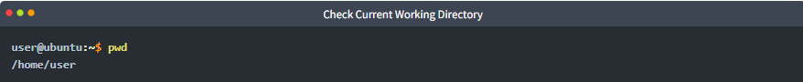
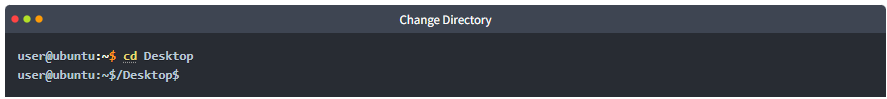
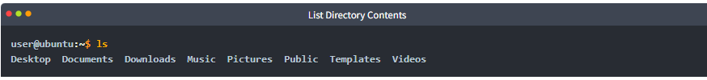
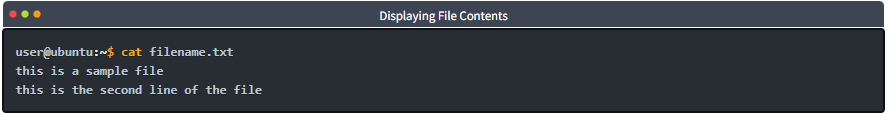
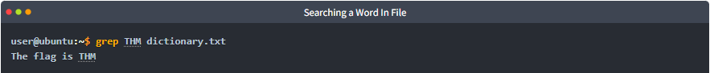

# Basic Shell Commands in Linux 

## Introduction: 

Most Linux distributions use Bash (Bourne Again Shell) as the default shell. However, the displayed shell when opening a terminal can vary depending on your Linux version. 

## Key Points: 

• We will discuss different types of shells in the upcoming task. 

• You have likely already learned basic Linux commands in the prerequisite module. 

• When using the shell, you need to be in the desired directory to perform operations. By default, you start in your home directory. 

• To check your current working directory, use the command `pwd`, which stands for Print Working Directory. For example, running `pwd` may show `/home/user`. 

• You can change your directory with the `cd` command. For example, using `cd Desktop` changes your location to the Desktop directory. 

• To see the contents of a directory, use the `ls` command. For instance, `ls` might list folders like Desktop, Documents, Downloads, etc. 

• To read a file's contents, enter `cat filename. txt`. This command displays the file's text. 

• The `grep` command searches for a specific word or pattern in files. For example, to find the word "THM" in a file, you would use `grep THM dictionary. txt`, which will display lines containing that word. 

## Conclusion: 
These basic commands are essential for navigating and interacting with the Linux shell effectively.