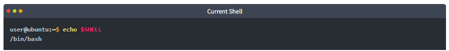
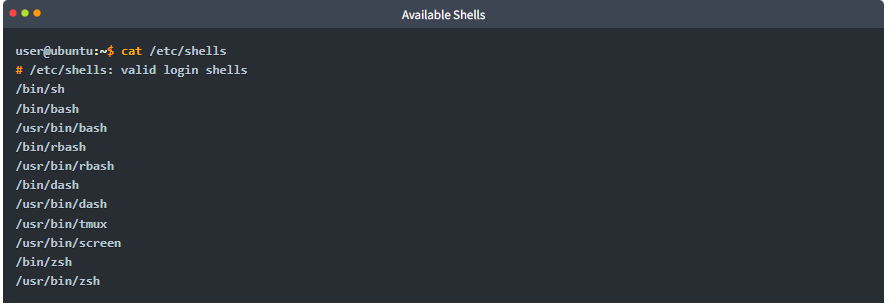
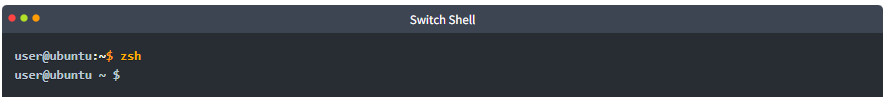
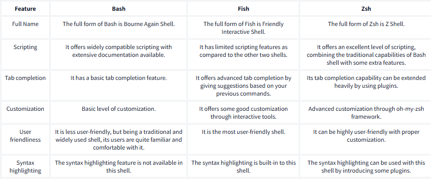

# Linux Shells 

## Introduction 
Linux, like Windows, has various types of shells that are used to interact with the operating system. Each shell has unique features and characteristics. This guide describes how to identify your current shell, list available shells, switch between them, and highlights some popular shells. 

## Key Points 

1. Identifying the Current Shell 

• To find out which shell you are currently using, enter the command: 

``` 
user@ubuntu:~$ echo $SHELL 
/bin/bash 
``` 



2. Listing Available Shells 

• You can view all installed shells on your Linux system by typing: 

``` 
user@ubuntu:~$ cat /etc/shells 
``` 

• This command will display a list of valid login shells, such as: 

``` 
/bin/sh 
/bin/bash 
/usr/bin/bash 
/bin/rbash 
/usr/bin/rbash 
/bin/dash 
/usr/bin/dash 
/usr/bin/tmux 
/usr/bin/screen 
/bin/zsh 
/usr/bin/zsh 
``` 



3. Switching Shells 

• To switch to a different shell, simply type the shell name: 

``` 
user@ubuntu:~$ zsh 
user@ubuntu ~ $ 
``` 



4. Changing the Default Shell 

• To make a shell your default, use the command: 

``` 
chsh -s /usr/bin/zsh 
``` 

5. Common Shells and Their Features 

• Bourne Again Shell (Bash): 

• Default for most Linux distributions. 

• Features: scripting capabilities, tab completion, command history. 

• Friendly Interactive Shell (Fish): 

• Focuses on user-friendliness. 

• Features: simple syntax, auto spell correction, 
customizable command prompts, and syntax highlighting. 

• Z Shell (Zsh): 

• A modern shell combining features of previous shells. 

• Features: advanced tab completion, auto spell correction, extensive customization options. 

6. Comparative Features of Shells 

• Feature | Bash | Fish | Zsh 

• Full Name: Bourne Again Shell | Friendly Interactive Shell | Z Shell 

• Scripting: Widely compatible | Limited features | Excellent level of scripting 

• Tab Completion: Basic | Advanced | Extensible with plugins 

• Customization: Basic | Good | Advanced through oh-my-zsh 

• User Friendliness: Less user-friendly | Most user-friendly | Highly customizable 

• Syntax Highlighting: Not available | Built-in | Available with plugins 




## Conclusion 
Choosing the best Linux shell depends on your specific needs and preferences. The mentioned shells each have unique features. Compare them to select the shell that best fits your tasks.