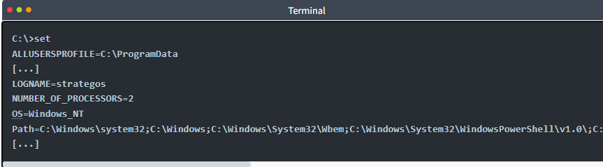
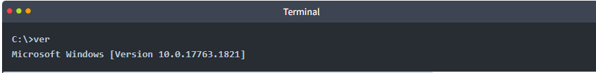
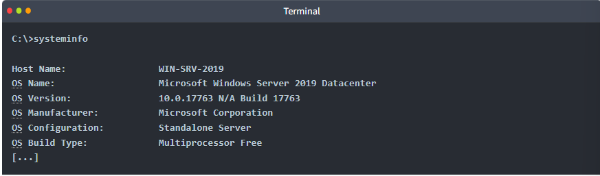

# Windows Command Operations 

## Introduction 
This content explains how to issue commands in Windows and check system information through the command line. 

## Key Points 
• Commands can only be issued within the Windows Path, which can be checked using the command `set`. 

• The output shows where Windows executes commands, starting with "Path=". 

• The `ver` command determines the operating system version, displaying results like "Microsoft Windows [Version 10. 0. 17763. 1821]". 

• The `systeminfo` command lists detailed system information, including OS name, version, and configuration. 

• For long outputs, use the `| more` command to view it page by page, exiting with CTRL + C. 

• Additional commands include `help` for assistance and `cls` to clear the screen. 

## Conclusion 
These commands provide essential tools for navigating and understanding Windows systems through the command line.