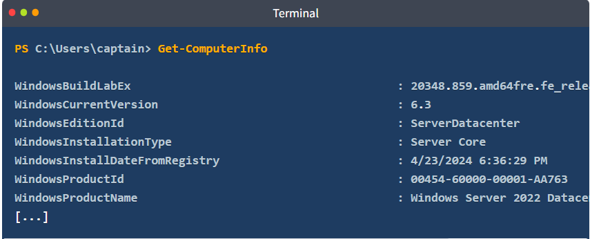
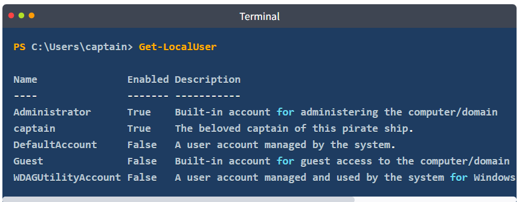
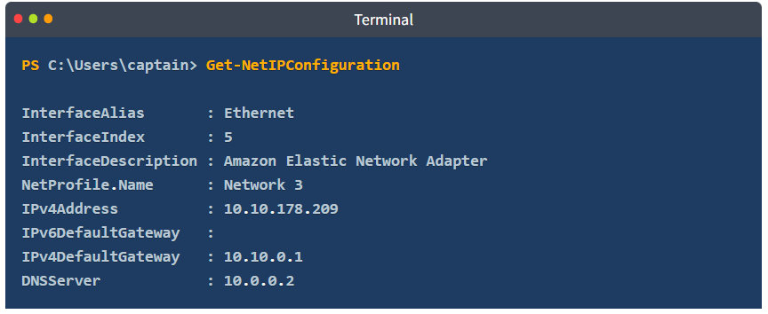
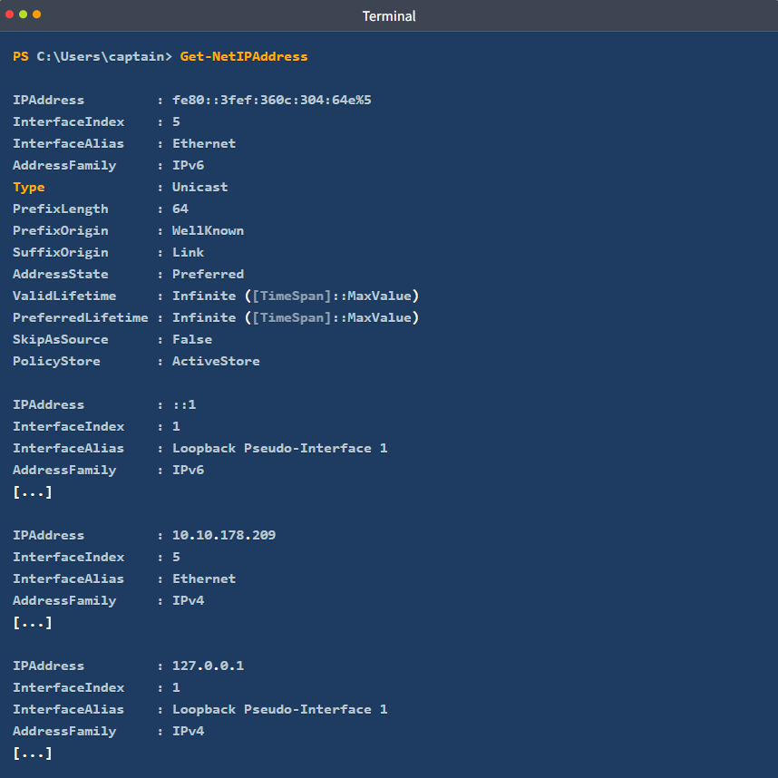

# PowerShell Cmdlets for System and Network Management 

## Introduction: 
PowerShell is designed as a tool for automating and managing systems, providing features beneficial to IT professionals. 

## Key Points: 

1. Get-ComputerInfo Cmdlet: 

• Retrieves extensive system details, like the operating system, hardware specs, and BIOS information. 

• Offers more comprehensive data than the traditional systeminfo command. 

__Example Output__: 

• Displays Windows build, version, edition, and installation date. 

2. Get-LocalUser Cmdlet: 

• Lists all local user accounts on the system with their status and descriptions. 

• Important for managing user accounts and security configurations. 

__Example Output__: 

• Shows names, enablement status, and descriptions for users like Administrator and Guest. 

3. Get-NetIPConfiguration Cmdlet: 

• Similar to ipconfig, this cmdlet provides details about network interfaces, including IP addresses and DNS servers. 

__Example Output__: 

• Displays network interface details like IPv4 address, gateway, and DNS servers. 

4. Get-NetIPAddress Cmdlet: 
• Shows all IP addresses configured on the system, including inactive ones. 

__Example Output__: 

• Provides details about both IPv4 and IPv6 addresses, including state and lifetime. 

## Conclusion: 
These cmdlets enable IT professionals to swiftly obtain vital system and network information through command-line access, improving the management and monitoring of machines.

# Try Hack Me Write Up

- Q: Other than your current user and the default "Administrator" account, what other user is enabled on the target machine?
- A: p1r4t3

- Q: This lad has hidden his account among the others with no regard for our beloved captain! What is the motto he has so bluntly put as his account's description?
- A: A merry life and a short one.

- Q: Now a small challenge to put it all together. This shady lad that we just found hidden among the local users has his own home folder in the "C:\Users" directory. 
Can you navigate the filesystem and find the hidden treasure inside this pirate's home?
- A:THM{p34rlInAsh3ll}
