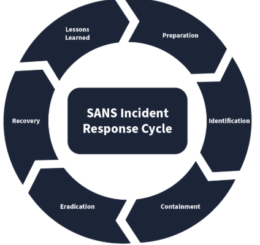
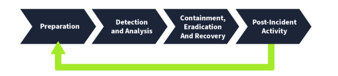
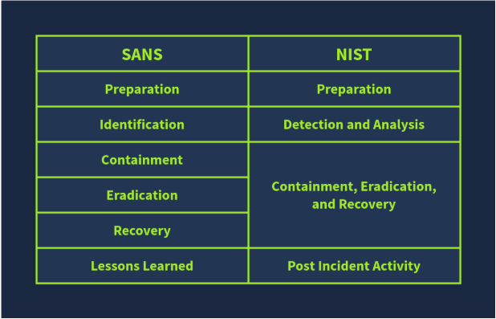

# Incident Response Frameworks: SANS and NIST 

## Introduction 
Dealing with various incidents in organizations can be challenging. To effectively manage these incidents, a structured process for incident response is essential. Incident Response Frameworks provide general methods to follow in any incident. This summary discusses the two widely used frameworks: SANS and NIST. 

## Key Points 
• SANS and NIST: Both organizations significantly contribute to cybersecurity. SANS provides various courses and certifications, while NIST focuses on developing standards and guidelines. Their incident response frameworks are similar. 

• SANS Incident Response Framework: This framework consists of six phases, easily remembered by the acronym 'PICERL': 

1. Preparation: Building resources for incident management, such as forming response teams and creating plans (e. g. , training employees on phishing). 
2. Identification: Detecting abnormal activities that may signal an incident, often using security solutions (e. g. , noticing data exfiltration from a compromised host). 
3. Containment: Minimizing the attack's impact by isolating affected systems (e. g. , disconnecting a compromised host from the network). 
4. Eradication: Removing the threat from the environment to ensure safety (e. g. , conducting malware scans). 
5. Recovery: Restoring affected systems from backup or by rebuilding them, ensuring they are safe for use (e. g. , reconfiguring systems and restoring data). 
6. Lessons Learned: Analyzing the incident to identify gaps and improve future responses (e. g. , holding a review meeting). 

• NIST Incident Response Framework: Similar to SANS, it has four phases, offering a streamlined approach in comparison. 

Comparing Both:

## Conclusion 
Organizations can create their incident response processes based on these frameworks, leading to a formal Incident Response Plan. This plan, approved by senior management, outlines procedures to follow before, during, and after an incident. Key components include roles and responsibilities, response methodology, communication plans, and escalation paths.