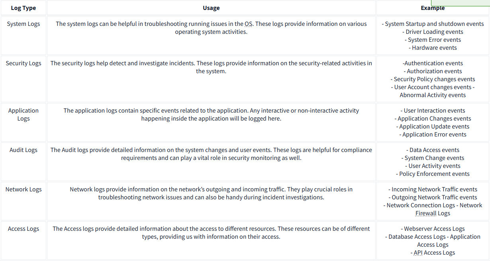

#  Log Analysis and Categorization 

## Introduction 
The document discusses the challenges of investigating system issues through logs and presents a solution by categorizing logs to aid in specific investigations. 

## Key Points 
1. Challenge with Logs: When attempting to investigate an issue through logs, the vast number of events can be overwhelming. 

2. Segregation of Logs: Logs are organized into various categories based on the type of information they provide. This allows for targeted investigations. 

3. Examples of Log Types: 
• System Logs: Useful for troubleshooting operating system issues and contain events like system startups and errors. 

• Security Logs: Aid in detecting security incidents and include authentication events and user account changes. 

• Application Logs: Store events related to application activities, such as user interactions and application errors. 

• Audit Logs: Provide detailed information about system changes and user actions, important for compliance and security. 

• Network Logs: Contain data about network traffic, critical for troubleshooting and incident investigation.
 
• Access Logs: Document access to resources like web and database servers. 

4. Log Analysis: This process involves extracting valuable data from logs to identify abnormal activities. Manual and automated techniques are used for this analysis. Upcoming tasks will focus on conducting manual log analysis on Windows and Web Server Access Logs. 

## Conclusion 
Understanding the types of logs and how to analyze them is essential for effective investigation and troubleshooting of system issues. The ability to categorize and focus on specific logs simplifies the process of extracting useful information.

