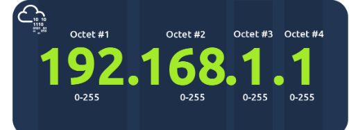
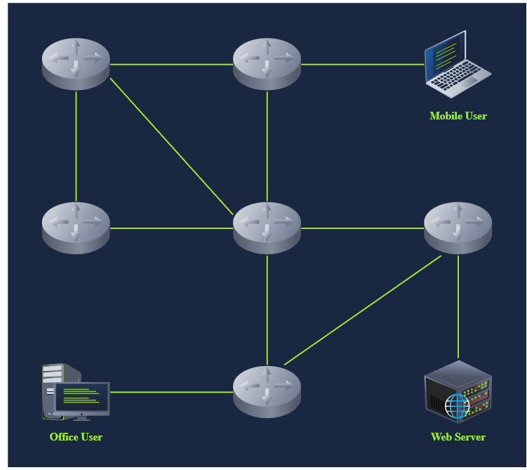

# Understanding IP Addresses 

## Introduction: 
An IP address is a unique identifier for devices on a network, allowing for clear communication. The most common version is IPv4, which consists of four octets. 

## Key Points: 

• Definition of IP Address: 
An IP address identifies a device in a network, similar to how a postal address works for home delivery. Examples of IPv4 addresses are 192. 168. 0. 1 and 172. 16. 159. 243. 

• Structure of IP Address: 
An IP address consists of four octets (32 bits), where each octet can represent a number between 0 and 255. For example, 192. 168. 1. 0 is used for network identification, whereas 192. 168. 1. 255 serves as the broadcast address for network-wide communication. 

• Total Unique Addresses: 
IPv4 only allows for about 4 billion unique addresses (approximately 2^32), not accounting for reserved addresses. 

• Finding Your IP Address: 
In Windows, you can use `ipconfig` to find your IP address. On Linux/UNIX, the command is `ifconfig` or `ip a s`. This will display your device's IP address, subnet mask, and broadcast address. 

• Understanding the Outputs: 
The output from the `ifconfig` or `ip a s` commands shows the host's IP (e. g. , 192. 168. 66. 89), subnet mask (e. g. , 255. 255. 255. 0, which can be written as /24), and broadcast address (e. g. , 192. 168. 66. 255). The /24 indicates that the first 24 bits of the IP address are consistent across the subnet. 

• Types of IP Addresses: 
There are two types of IP addresses: 

1. Public IP Addresses - Accessible from the internet. 

2. Private IP Addresses - Used within local networks and not 
reachable from outside. The ranges defined by RFC 1918 for private IP addresses are: 

• 10. 0. 0. 0 to 10. 255. 255. 255 

• 172. 16. 0. 0 to 172. 31. 255. 255 

• 192. 168. 0. 0 to 192. 168. 255. 255 

• Function of Routers: 
Routers are compared to post offices. They manage data packets' delivery across networks, forwarding them based on their IP addresses to ensure they reach their final destinations. Routers operate at layer 3 of the OSI model, determining the best path for data transfer. 

## Conclusion: 
In summary, an IP address is crucial for device communication in a network. Understanding how to identify your IP address, the types of addresses, and the role of routers is essential for navigating network configurations and connectivity.