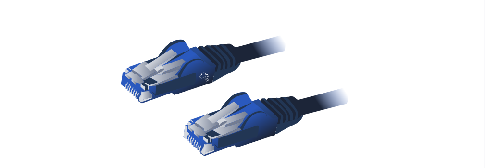
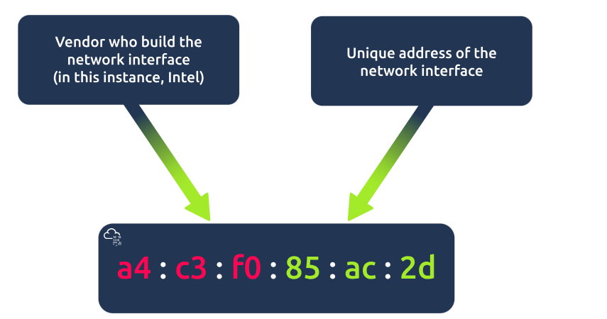
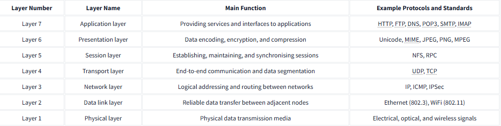

# OSI Model 

## Introduction 
The __OSI__ (Open Systems Interconnection) model is a framework created by the International Organization for Standardization (ISO) that outlines how communication should take place in computer networks. Understanding this model is crucial for grasping networking concepts. The OSI model consists of seven layers, each with its specific function. 

## Key Points: 

1. Seven Layers of the OSI Model: 
• The OSI model is divided into seven layers, numbered from 1 to 7, starting with the physical layer at the bottom and the application layer at the top. A helpful mnemonic to remember the order is “Please Do Not Throw Spinach Pizza Away. ” 

2. Layer 1: Physical Layer 
• This layer is concerned with the physical connection between devices, including the medium used for transmission (like wires or wireless signals). Common examples of physical medium include Ethernet cables and WiFi bands, which transmit data using electrical or optical signals. 

3. Layer 2: Data Link Layer 
• The data link layer allows data transfer between devices on the same network segment. It establishes rules for communication between systems in that segment. Common examples include Ethernet (802. 3) and WiFi (802. 11), and it uses MAC addresses for device identification. 

4. Layer 3: Network Layer 
• This layer is responsible for sending data between different networks. It handles logical addressing and routing, ensuring packets find the best path to travel between various networks. Protocols like IP and ICMP operate at this level. 

5. Layer 4: Transport Layer 
• The transport layer manages end-to-end communication between applications on different hosts. It supports functions like flow control and error correction, with protocols such as TCP and UDP used at this layer. 

6. Layer 5: Session Layer 
• The session layer oversees establishing, maintaining, and synchronizing communication sessions between applications. It negotiates session parameters and ensures data is transmitted in the proper order. Examples include NFS and RPC. 

7. Layer 6: Presentation Layer 
• This layer prepares data for the application layer, ensuring it is in a format that can be understood. It deals with data encoding, compression, and encryption. Examples of standards include ASCII and MIME for emails. 

8. Layer 7: Application Layer 
• The application layer provides services to end-user applications. It utilizes various protocols for tasks like requesting files or sending emails, with examples including HTTP, FTP, and SMTP. 

## Conclusion: 
Understanding the OSI model is essential for anyone studying networking. Each layer has distinct functions and protocols, and remembering these layers is crucial for grasping networking concepts. To aid in learning, a summary table of the OSI layers with their functions and examples is helpful for quick reference.