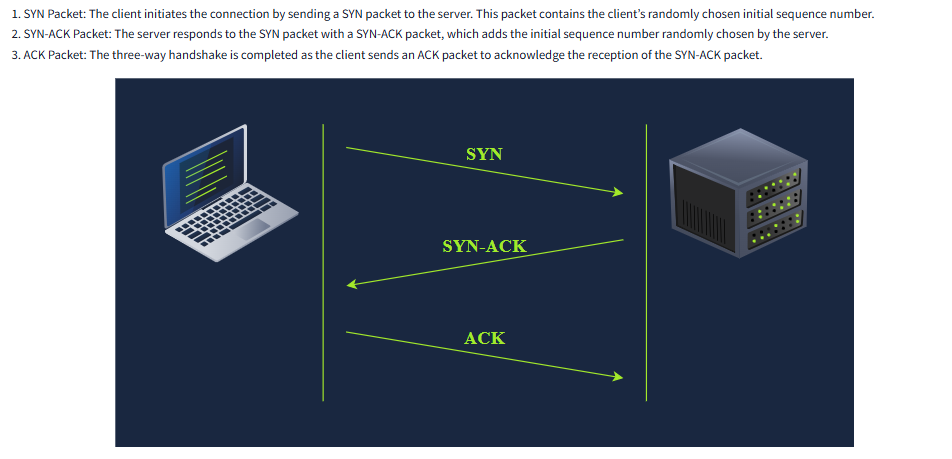

# The IP Protocol and Transport Protocols 

The Internet Protocol (IP) helps us reach a specific host on a network using its IP address. To enable communication between processes on these networked hosts, we use two transport protocols: UDP and TCP. 

## UDP (User Datagram Protocol) 
UDP is a basic, connectionless protocol that functions at the transport layer (layer 4). It allows communication with a specific process on the target host without needing to establish a connection. UDP does not have a delivery confirmation system, meaning there is no guarantee that the packets will arrive. Port numbers, which range from 1 to 65535 (with port 0 reserved), help identify the sending and receiving processes. 

A real-life example of UDP is standard mail that is sent without delivery confirmation, allowing faster and cheaper service but without guarantees. 

## TCP (Transmission Control Protocol) 
TCP, unlike UDP, is a connection-oriented protocol that ensures reliable delivery of data. It also operates at layer 4. TCP requires a connection to be established before any data transfer, using a process called a three-way handshake involving three packets: the SYN packet, the SYN-ACK packet, and the final ACK packet. Each data packet in TCP has a sequence number, helping the receiver detect lost or duplicated packets. The receiver also sends an acknowledgment number to confirm receipt. 

Like UDP, TCP uses port numbers ranging from 1 to 65535 for process identification. 

A TCP Connection is established with:

## Conclusion 
Both UDP and TCP serve as transport protocols, each with distinct features suited to different needsUDP for speed and low cost, and TCP for reliable communication.