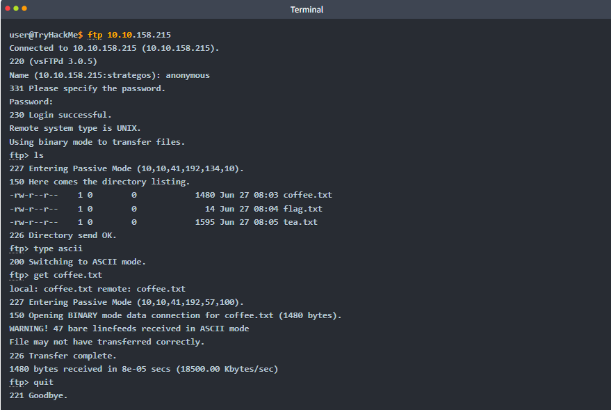
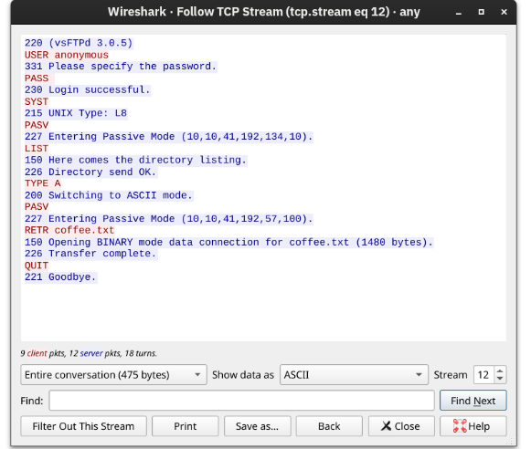

# FTP File Transfer Process 

## Introduction 
File Transfer Protocol (FTP) is specifically designed for transferring files, making it more efficient and often faster than HTTP. 

## Key Points 

• __FTP Commands__: 

• __USER__: Input username. 

• __PASS__: Enter password. 

• __RETR__: Download a file from the FTP server. 

• __STOR__: Upload a file to the FTP server. 

• __Connection Details__: 

• FTP operates on TCP port 21, while data transfer uses a separate connection. 

• Example Execution Steps: 

• Command `ftp 10. 10. 158. 215` connects to the FTP server. 

• Login with username "anonymous" without a password. 

• The command `ls` lists available files for download. 

• The command `type ascii` changes the transfer mode to ASCII for text files. 

• `get coffee. txt` retrieves the desired file. 

## Terminal Output Analysis 

• A sample terminal output is provided to illustrate the command execution process, showing successful connection, login, file listing, and file transfer. 



• Wireshark was used to analyze the exchanged messages, showing client messages in red and server responses in blue. Notably, commands like `ls` are sent as `LIST` from the client to the server. Directory listings and downloaded files occur over separate connections. 



## Conclusion 
This content outlines the fundamental operations and details of using FTP for file transfers, including command structure and connection processes.

# Try Hack Me Write UP

- Q: Using the FTP client ftp on the AttackBox, access the FTP server at 10.10.158.215 and retrieve flag.txt. What is the flag found?
- A: THM{FAST-FTP}

- C: 
``` bash
ftp MACHINE_IP
user: anonymous
password: (click enter)
ls (check for flag)
get flag.txt
exit
cat flag.txt
__Output__:THM{FAST-FTP}

```