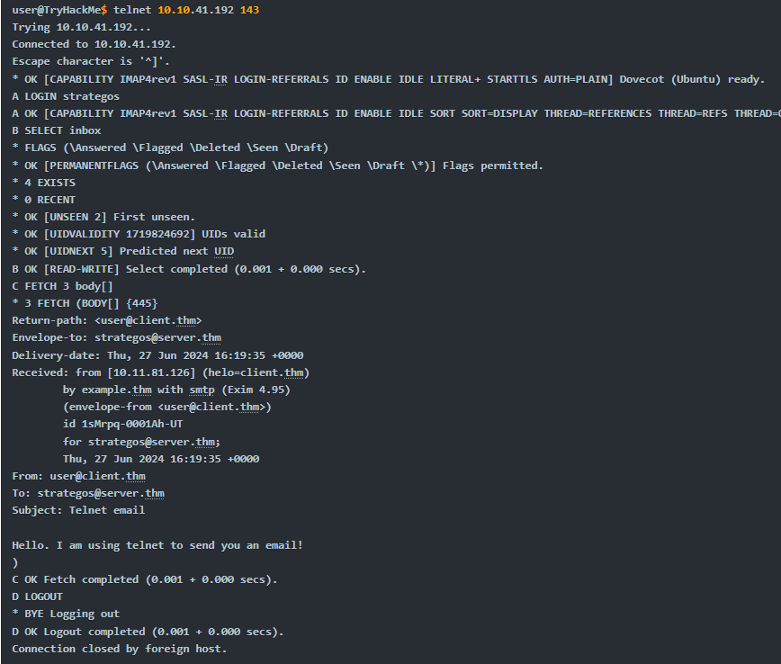

# Email Protocols: POP3 vs. IMAP 

## Introduction: 
When managing emails on one device, the Post Office Protocol version 3 (POP3) is sufficient. However, if you need to access your emails from various devices like a desktop computer, laptop, or smartphone, a more advanced protocol is required for message synchronization. The Internet Message Access Protocol (IMAP) is the solution for keeping your mailbox synchronized across multiple devices. 

## Key Points: 
• IMAP allows synchronization of read, moved, and deleted messages, making it ideal for users who check emails from different clients. 

• Unlike POP3, which reduces server storage by downloading emails and deleting them from the remote server, IMAP retains emails on the server, utilizing more storage. 

• IMAP commands are more complex than those of POP3. Examples include: 

• `LOGIN `: Authenticates the user. 

• `SELECT `: Selects a mailbox folder to work with. 

• `FETCH `: Fetches the specified message. 

• `MOVE `: Moves messages to another mailbox. 

• `COPY `: Copies messages to another mailbox. 

• `LOGOUT`: Logs out of the session.

• The default port for IMAP is TCP port 143, and a connection can be established using tools like telnet. 

## Conclusion: 
IMAP provides a more flexible way to handle emails across different devices compared to POP3. The ability to keep emails synchronized makes it essential for users who frequently switch between various email clients. The use of telnet to connect to an IMAP server allows users to interactively manage their emails, ensuring efficient communication.

# Try Hack Me Answers

- Q: What IMAP command retrieves the fourth email message?

- A: FETCH 4 body []