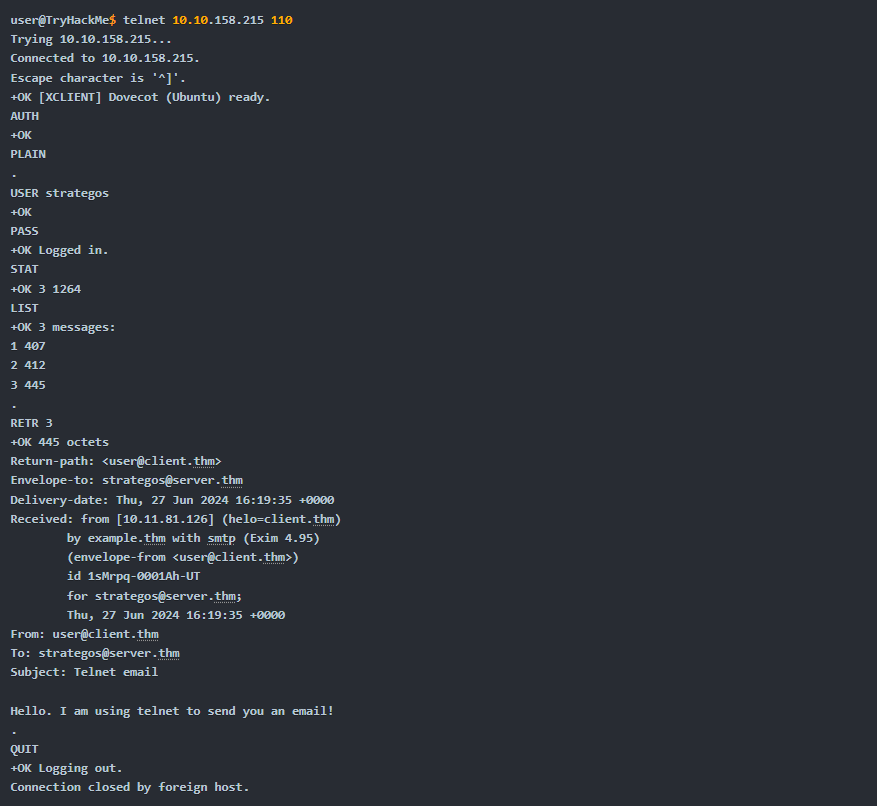

# POP3 Email Retrieval 

## Introduction 
This content explains how to download an email using the Post Office Protocol version 3 (POP3) and illustrates the process through an example of a POP3 session. 

## Key Points 
• POP3 allows email clients to communicate with mail servers to retrieve messages. 

• It works alongside the Simple Mail Transfer Protocol (SMTP), where SMTP is like sending mail to the post office, and POP3 is like checking your mailbox. 

• POP3 operates using specific commands: 

• `USER `: identifies the user. 

• `PASS `: provides the user's password. 

• `STAT`: requests the number of messages and size. 

• `LIST`: lists messages and their sizes. 

• `RETR `: retrieves a specified message. 

• `DELE `: marks a message for deletion. 

• `QUIT`: ends the session and applies changes. 

• An example terminal session demonstrates connecting to a POP3 server and retrieving a message. 

• The commands exchanged between the client and server are visible to someone monitoring the network, showing that passwords are also exposed. 

## Conclusion 
The document outlines how POP3 is utilized for retrieving emails, the commands involved, and the security risks associated with monitoring network traffic during the session.