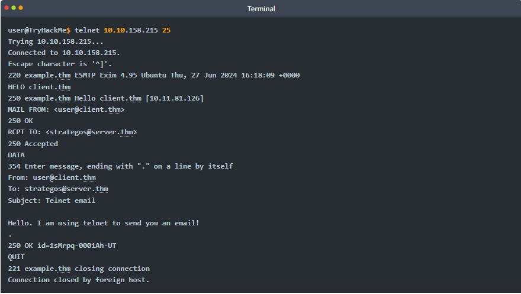

# Understanding Simple Mail Transfer Protocol (SMTP) 

## Introduction: 
The Simple Mail Transfer Protocol (SMTP) is essential for sending emails, functioning similar to how a post office processes packages. 

## Key Points: 
• SMTP defines communication between a mail client and a mail server, and between different mail servers. 

• The process of sending an email via SMTP is akin to sending a package at a post office, where the sender provides information and the package. 

• __Key SMTP commands include__: 

• HELO or EHLO: Starts the SMTP session. 

• MAIL FROM: Indicates the sender's email address. 

• RCPT TO: Designates the recipient's email address. 

• DATA: Signals the beginning of the email content. 

• A period (. ) on a separate line marks the end of the email. 

• An example of sending an email through telnet illustrates these commands in practice, showing the interaction with the SMTP server on TCP port 25. 

• Per the Wireshark capture, the client’s messages appear in red, while server responses show in blue. 

## Conclusion: 
The SMTP process provides a clear view of email sending mechanics, paving the way for a better understanding of other text-based protocols like POP3 and IMAP.