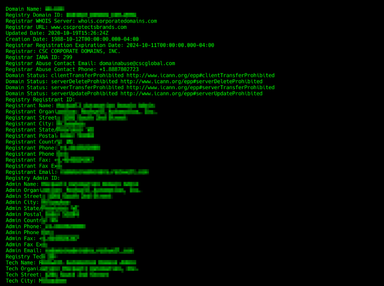
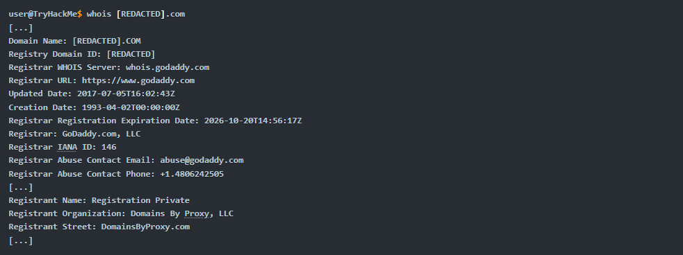

# Domain Name Registration and WHOIS Records 

## Introduction: 
This content explains how domain names are linked to IP addresses and the registration process for domain names, including privacy options available for registrants. 

## Key Points: 
• A domain name, like example.com, is linked to an IP address through DNS records (A, AAAA, MX). 

• The person who registers a domain name has the authority to set its DNS records. 

• Domains can be registered for one or more years, requiring an annual fee and accurate contact information for the registrant. 

• Registrant information is publicly available through WHOIS records, which include name, phone number, email, and address. 

• To protect privacy, registrants can use services that conceal their contact information in WHOIS records. 

• The WHOIS command can be used to look up registered domain names and view their records. 

• An example output of a WHOIS lookup shows details such as registration dates and registrant information, including privacy protection details. 

## Conclusion: 
Understanding domain registration and WHOIS records is essential for managing domain names and ensuring privacy when desired.