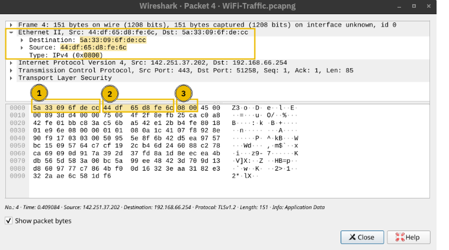
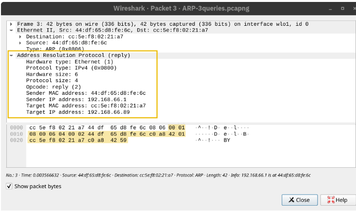
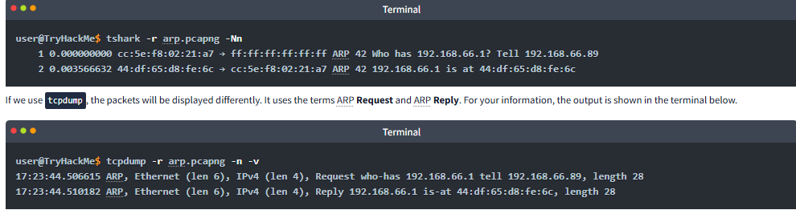

# Networking Concepts: IP Packet Communication and ARP 

## Introduction 
This summary outlines how hosts communicate in a network using IP packets and MAC addresses, along with the role of Address Resolution Protocol (ARP) in facilitating this communication. 

## Key Points 
• When two hosts communicate over a network, an IP packet is encapsulated within a data link frame at layer 2. The primary data link layers used are Ethernet (IEEE 802. 3) and WiFi (IEEE 802. 11). 

• While a host knows the IP address of another host, it must first find out the target host's MAC address in order to create the correct data link header. 

• A MAC address is a 48-bit number, commonly displayed in hexadecimal, such as 7C:DF:A1:D3:8C:5C. 

• On a local Ethernet network, hosts only need to know each other’s MAC addresses for communicating directly. IP addresses are central to networking. 

• When connecting to a network with a DHCP server, a device is automatically assigned a gateway (router) and DNS server IP addresses, but MAC addresses are not disclosed at this stage. 

• Two devices cannot communicate directly on Ethernet without each other’s MAC addresses. 

• An IP packet is shown within an Ethernet frame, which includes the destination and source MAC addresses, along with the type of protocol used (e. g. , IPv4). 

## ARP (Address Resolution Protocol) 
• ARP enables a host to discover the MAC address of another device on the same network. For example, if a host with IP address 192. 168. 66. 89 wants to communicate with 192. 168. 66. 1, it sends an ARP Request. 

• The ARP Request is sent to a broadcast MAC address, and the corresponding device replies with its MAC address. 

• ARP requests and replies are directly encapsulated in Ethernet frames and are considered layer 2, although they also support layer 3 IP operations by translating addresses. 

## Conclusion 
Understanding the interaction between IP addresses, MAC addresses, and ARP is crucial for effective communication between devices in a network. ARP facilitates the necessary translations for devices to communicate directly over Layer 2 and Layer 3.

# Try Hack Me Write Up

- Q: What is the destination MAC address used in an ARP Request?

- A: ff:ff:ff:ff:ff:ff

- Q: In the example above, what is the MAC address of 192.168.66.1?

- A: 44:df:65:d8:fe:6c