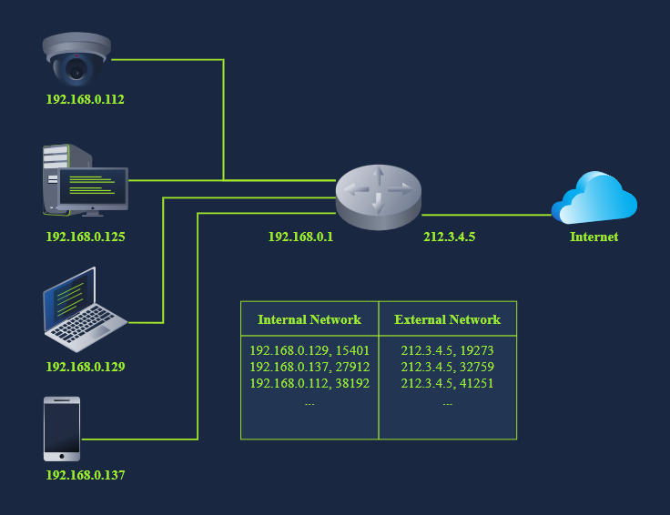

# Understanding Network Address Translation (NAT) 

## Introduction: 
In the Networking Concepts room, we discussed the limitations of IPv4, which can only support about four billion devices. As more devices connect to the Internet, the number of available IPv4 addresses is quickly being used up. One effective solution to this problem is Network Address Translation (NAT). 

## Key Points: 

• NAT allows multiple devices to share one public IP address by using private IP addresses within the internal network. 

• For example, twenty computers in a company can connect to the Internet through a single public IP address instead of needing twenty separate ones. 

• Although technically, two public IP addresses are reserved, this results in a savings of thirty public IP addresses. 

• NAT-supporting routers track ongoing connections using a translation table, converting addresses between internal and external networks. 

• The internal network employs private IP addresses, while the external network uses a public IP address.

• Each connection from a device is represented to the web server as coming from the router's public IP address, not the private IP address of the device. 

## Conclusion: 
NAT efficiently connects private networks to the Internet using fewer public IP addresses by managing address translation for ongoing connections.