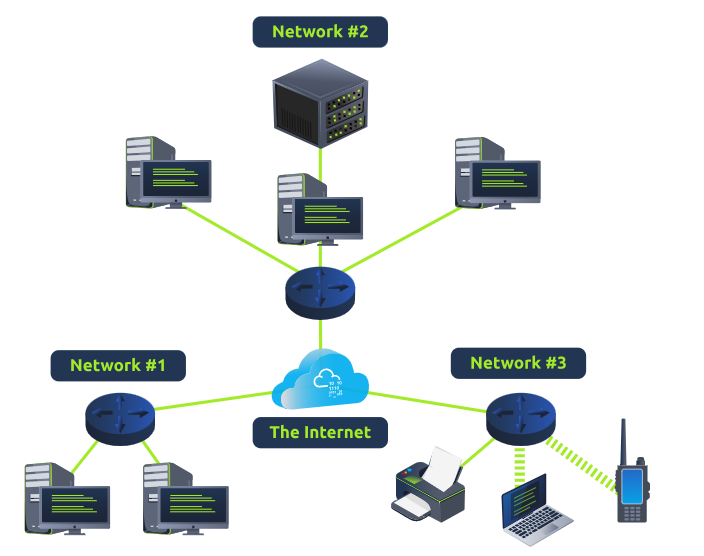

# Routing Protocols

* OSPF (Open Shortest Path First): OSPF is a routing protocol that allows routers to share information about the network topology and calculate the most efficient paths for data transmission. It does this by having routers exchange updates about the state of their connected links and networks. This way, each router has a complete map of the network and can determine the best routes to reach any destination.
* EIGRP (Enhanced Interior Gateway Routing Protocol): EIGRP is a Cisco proprietary routing protocol that combines aspects of different routing algorithms. It allows routers to share information about the networks they can reach and the cost (like bandwidth or delay) associated with those routes. Routers then use this information to choose the most efficient paths for data transmission.
* BGP (Border Gateway Protocol): BGP is the primary routing protocol used on the Internet. It allows different networks (like those of Internet Service Providers) to exchange routing information and establish paths for data to travel between these networks. BGP helps ensure data can be routed efficiently across the Internet, even when traversing multiple networks.
* RIP (Routing Information Protocol): RIP is a simple routing protocol often used in small networks. Routers running RIP share information about the networks they can reach and the number of hops (routers) required to get there. As a result, each router builds a routing table based on this information, choosing the routes with the fewest hops to reach each destination.

