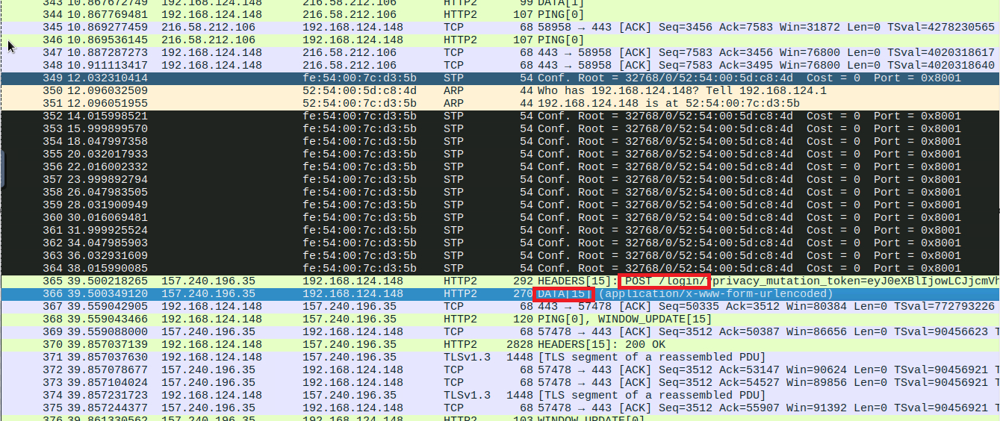
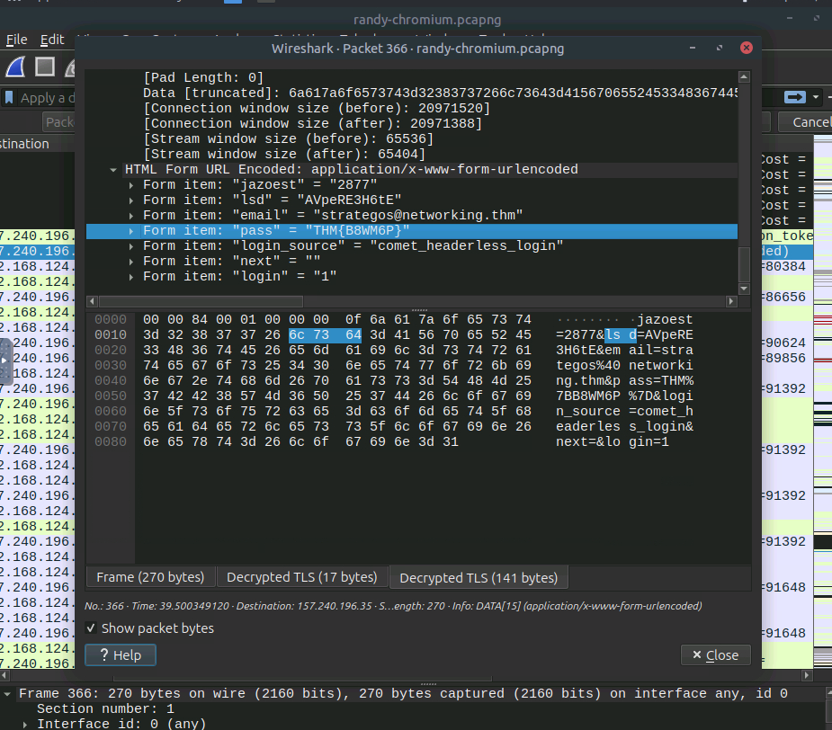

# Challenge Write UP

The challenge is a basic one where the player needs to use a ssl-key to decrypt the tls of the request packets to find a POST request containing data with the user password.

Clicking with right mouse -> transport layer security -> open transport layer security preferences -> choosing the ssl-key.log file, the packets will be decrypted allowing us to see their data.

Then all that is left is looking for a POST request with data. In this case was the packet number 366.

The following screenshots shows the solution.

