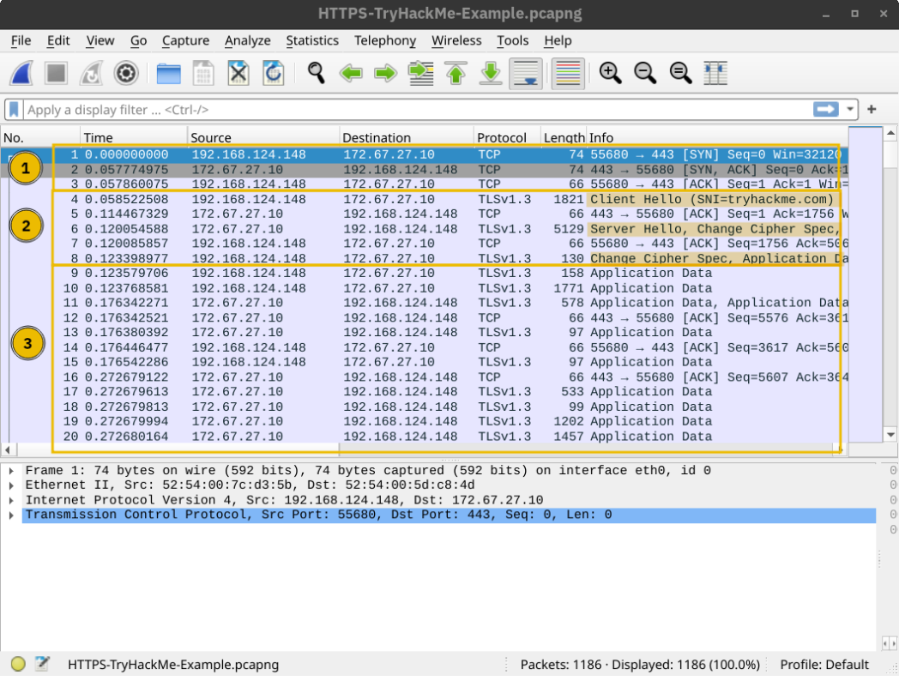
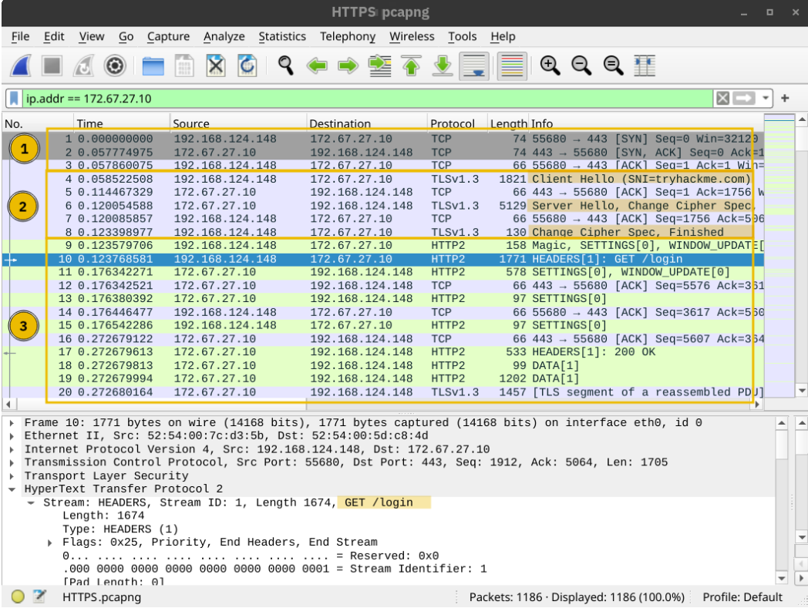

# HTTP and HTTPS Protocols 

## Introduction 
This content explains how HTTP and HTTPS work, highlighting the reliance of HTTP on TCP and how HTTPS adds a layer of security using TLS. 

## Key Points 
• HTTP Protocol Basics: HTTP (Hypertext Transfer Protocol) uses TCP (Transmission Control Protocol) and operates on port 80 by default. HTTP traffic is sent in clear text, making it vulnerable to interception. 

• Steps for HTTP Requests: 
1. Resolve the domain name to an IP address. 
2. Establish a TCP three-way handshake with the server. 
3. Communicate using the HTTP protocol, e. g. , issuing requests like GET / HTTP/1. 1. 

• Wireshark Analysis: In a Wireshark screenshot, the TCP handshake happens first, followed by the HTTP request and response, ending with TCP connection termination. 

• HTTPS Protocol Basics: HTTPS (Hypertext Transfer Protocol Secure) is HTTP combined with TLS (Transport Layer Security). The process to request a page over HTTPS includes: 
1. Resolving the domain name to an IP address. 
2. Establishing a TCP three-way handshake. 
3. Establishing a TLS session. 
4. Communicating using HTTP, similar to HTTP over TCP. 

• Wireshark Analysis for HTTPS: A Wireshark screenshot shows packets for the TCP handshake, followed by packets for negotiating TLS, and encrypted application data. The actual data remains hidden without the decryption key. 

• Encryption and Security: With TLS, the contents of the packets are encrypted, making it difficult to view the exchanged data without the encryption key. After providing a decryption key to Wireshark, you can see the HTTP requests and responses. 

## Conclusion 
The main takeaway is that TLS enhances HTTP security without modifying TCP or IP protocols. This means HTTP is simply sent over TLS, maintaining the regular function while protecting the data being transmitted.