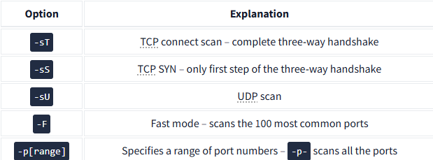

# Discovering Network Services on Live Hosts 

In this task, we will learn how to find network services that are actively listening on live hosts. A network service is any process that is waiting for incoming connections on TCP or UDP ports. Common examples include web servers on TCP ports 80 and 443, and DNS servers on UDP (and TCP) port 53. 

## Key Points 

1. Understanding Ports: TCP and UDP each have 65,535 ports. We need a method to discover which ports have active services. 

2. Scanning TCP Ports: 
• The simplest way to check if a TCP port is open is by using telnet to create a TCP connection to each target port. Only open TCP ports will successfully respond to this connection attempt. 

• Connect Scan: This can be done using the `-sT` option in Nmap, which completes the TCP three-way handshake. If successful, Nmap will close the connection. 

• An example shows IP 192. 168. 124. 148 with port 22 open and port 23 closed. The successful handshake is marked and can be identified alongside a closed port response. 

3. SYN Scan (Stealth): 
• The SYN scan, indicated by `-sS`, only sends a TCP SYN packet to test if a port is open without completing the handshake. This method is stealthy as it creates fewer logs.

• In an example with port 22 open, a SYN-ACK response indicates the listening service, while a connection to a closed port shows a TCP RST packet. 

4. Scanning UDP Ports: 
• Many services use UDP, including DNS and VoIP. UDP does not require a connection to be established. 

• Use Nmap with the `-sU` option to scan for UDP services. Closed UDP ports send ICMP "port unreachable" messages. 

5. Limiting the Target Ports: 

• By default, Nmap scans the most common 1,000 ports. 

• The `-F` option allows you to quickly scan the 100 most common ports. 

• The `-p[range]` option specifies which ports to scan, for example, `-p10-1024` scans from port 10 to 1024, and `-p-` scans all ports from 1 to 65,535. 

## Summary

## Conclusion 

In summary, the Nmap options provide various methods to scan and identify open TCP and UDP ports. The different scanning techniques, such as the TCP connect scan and the SYN scan, help in detecting potentially active services while considering stealth and thoroughness. Use the appropriate option depending on your specific needs in discovering network services.