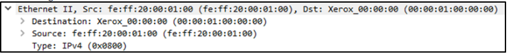

# Packet Dissection 

Packet dissection, or protocol dissection, involves examining packet information by decoding the protocols and fields present. Wireshark, a tool used for this purpose, supports many protocols and allows users to create their own dissection scripts. 

This section explains how Wireshark utilizes OSI layers to analyze packets. A basic understanding of the OSI model is required before proceeding. 

## Packet Details 

To view packet details, click on a packet in the list; double-clicking opens the details in a new window. Packets can have 5 to 7 layers based on the OSI model. For example, packet number 27 is displayed. 

When clicking on a detail, it highlights the associated part in the packet bytes pane. 

The packet comprises seven distinct layers: 
1. Frame (Layer 1): Shows the frame/packet details corresponding to the Physical layer of 
the OSI model. 

2. Source [MAC] (Layer 2): Displays source and destination MAC Addresses, linked to the Data Link layer. 

3. Source [IP] (Layer 3): Presents source and destination IPv4 Addresses, tied to the Network layer. 

4. Protocol (Layer 4): Highlights protocol used (UDP/TCP) and source/destination ports from the Transport layer. 

5. Protocol Errors: Identifies segments from TCP that required reassembly, continuing from the 4th layer. 
6. Application Protocol (Layer 5): Shows specifics of the application protocol, such as HTTP or FTP, from the Application layer. 

7. Application Data: Displays the specific data related to the application. 

