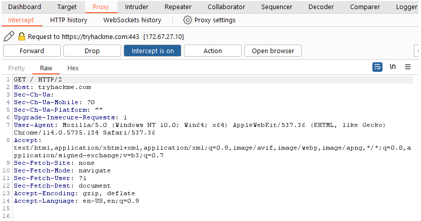

# Burp Proxy in Burp Suite 

Burp Proxy is an essential component of Burp Suite, allowing users to capture and manage requests and responses between themselves and the target web server. This intercepted traffic can be modified, redirected, or allowed to proceed to its destination. 

## Key Points to Understand About the Burp Proxy 
• Intercepting Requests: Requests made through Burp Proxy are intercepted and held back from reaching the server, showing up in the Proxy tab for actions like forwarding or editing. To let requests continue without interruption, toggle the "Intercept is on" button. 

• Taking Control: Intercepting requests gives testers full control over web traffic, crucial for web application testing. 

• Capture and Logging: Burp Suite automatically logs requests through the proxy, aiding future analysis even when interception is off. 

• WebSocket Support: The tool also captures WebSocket communications, further assisting in web application analysis. 

• Logs and History: Captured requests can be reviewed in HTTP and WebSocket history for later analysis and redirection to other Burp modules. 

Users can access proxy-specific options through the Proxy settings button, which offers detailed control over the Proxy’s behavior. Notable features include response interception and the "Match and Replace" function, which utilizes regex for modifying requests dynamically. Users are encouraged to explore these options to improve their proficiency.