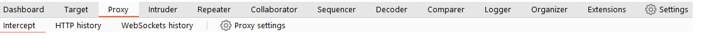

# Burp Suite Navigation Overview 

Burp Suite primarily uses a top menu bar for navigation, allowing you to switch between modules and access sub-tabs. The sub-tabs are located in a second menu bar just below the main one. 

## Key Points: 

• Module Selection: The top menu bar shows available modules, like Burp Proxy, which can be clicked to switch between them. 

• Sub-Tabs: Selected modules may have multiple sub-tabs accessible in the second menu bar, containing settings and options specific to that module. 

• Detaching Tabs: You can detach tabs into separate windows by selecting "Detach" from the Window option in the menu, and reattach them the same way. 

• Keyboard Shortcuts: Shortcuts are available for quick access to major tabs, such as: 

• Ctrl + Shift + D for Dashboard 

• Ctrl + Shift + T for Target tab 

• Ctrl + Shift + P for Proxy tab 

• Ctrl + Shift + I for Intruder tab 

• Ctrl + Shift + R for Repeater tab