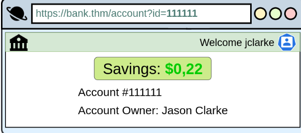

# Broken Access Control Vulnerabilities 

## Introduction
Websites often have pages that should only be accessible to certain users, like admins. If these pages can be accessed by regular visitors, then access controls are compromised. 

## Key Points: 
• Regular visitors accessing protected pages can lead to exposure of sensitive user information and unauthorized functionalities. 

• Broken access control enables attackers to bypass security, viewing confidential data or executing unintended actions. 

• An example from 2019 highlighted a vulnerability where an attacker could retrieve frames from a private Youtube video, which is a clear instance of broken access control. 

# Insecure Direct Object Reference

Insecure Direct Object Reference (IDOR) is a security issue that lets users access resources they shouldn't see. This problem happens when a programmer makes identifiers for objects on a server visible. These objects can be files, users, or accounts. 

For example, when logging into a bank account, you might see a URL like https://bank. thm/account? id=111111, allowing access to your account details. However, if someone changes the id parameter to another number, like 222222, they might access another person's bank information if the system is not configured correctly. 

The issue arises because the application does not check if the logged-in user is allowed to access the account linked to the ID. The vulnerability lies in the lack of validation for access rights, not in the direct object references themselves.

## Conclusion 
Properly implemented access controls are essential to protect sensitive information and functionalities on websites.

# Try Hack Me Challenge

GO to the MACHINE_IP , and login. Define ID as 0 and you get flag{fivefourthree}.

