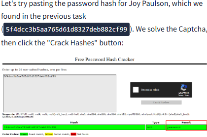

# Cryptographic Failures

## Definition of cryptographic failure 
 - Vulnerability from misuse or lack of use of cryptographic algorithms
 - Important for protecting sensitive information in web applications

## Example: Secure Email Application
 - Encryption needed for communications between user and server
 - Protects against eavesdroppers capturing network packets
 - Encrypting data in transit refers to this encryption of network traffic
 
## Email Storage Concerns
 - Emails should be encrypted on the provider’s server
 - This process is known as encrypting data at rest

## Consequences of Cryptographic Failures
 - Web apps may unintentionally reveal sensitive data 
 - Data linked to customers includes names, dates of birth, financial details, usernames, and passwords

## Advanced Attack Techniques
 - "Man in The Middle Attacks"
 - Attacker controls device to intercept user connections
 - Weak encryption allows access to intercepted data
 - Simpler vulnerabilities exist, not requiring advanced knowledge
 - Sensitive data may sometimes be located directly on web servers

## Instruction of Try Hack Me
 - Read through supporting material in the following tasks to learn more about vulnerabilities.

# Database Management and Flat-File Databases 

## Introduction: 
This content discusses how to store large amounts of data accessibly, particularly focusing on flat-file databases, which are simpler than server-based databases. 

## Key Points: 
• Databases are commonly used to store data for web applications, allowing multiple users to access information at once. 

• Database engines typically use SQL syntax for interactions. 

• In production settings, databases often run on dedicated servers with services like MySQL or MariaDB, but they can also be flat-file databases stored as single files. 

• Flat-file databases are simpler and can be suitable for smaller applications.

• If a flat-file database is improperly stored within the website’s accessible directory, it can pose a security risk, allowing unauthorized access to sensitive data. 

• SQLite is a common format for flat-file databases, which can be accessed using the sqlite3 command-line client available on many Linux systems. 

• Example commands were provided for listing files and accessing a SQLite database.

• Once inside the database, users can view table names and retrieve data from specific tables with commands like `. tables` and `SELECT `. 

• The example included retrieving information from a table named "customers," showing columns for customer ID, name, credit card information, and password hash. 

• The content ends by indicating that the next step will involve attempting to crack the password hash retrieved from the database. 

## Conclusion: 
Understanding how to access and manage flat-file databases is crucial for handling data in web applications, especially regarding security and the potential risks associated with sensitive data exposure.


# Hash Cracking Using Crackstation 

## Introduction 
The previous task involved querying an SQLite database for sensitive data, revealing a set of password hashes for users. This task focuses on how to crack these hashes. 

## Key Points 
• Kali Linux has various tools for hash cracking, but these are not covered in this material.

• We will use an online tool called Crackstation, which is effective for weak password hashes, particularly MD5 hashes.

• Upon visiting Crackstation, users can paste a hash, such as Joy Paulson's (5f4dcc3b5aa765d61d8327deb882cf99), solve a Captcha, and click "Crack Hashes. " 



• The tool successfully cracked the hash, revealing the password "password. " 

• Crackstation relies on a large wordlist; if a password isn’t in it, the hash cannot be cracked. 

• If Crackstation fails, the hash may be intentionally designed to be uncrackable. 

## Conclusion 
Crackstation is a useful online resource for breaking weak MD5 password hashes, though its effectiveness is limited by the contents of its wordlist.

# Try Hack Me Challenge

First we need to find out what directory we need to look for. So i Use dirb.
```bash
   dirb http://10.10.227.233:81/
```
We got the /assets directory.

In that directory we have the webapp.db, which with sqlite3 command we can access.
Using the following commands give us access to the users:
    ```SQL
        .tables
        PRAGMA table_info (users);
        SELECT * FROM users;
    ```
Now we got the hash for the admin user, being md5 encryption if farely easy to break. Go to crackstation online and they will give you the password: qwertyuiop.
Login as admin we get: THM{Yzc2YjdkMjE5N2VjMzNhOTE3NjdiMjdl}