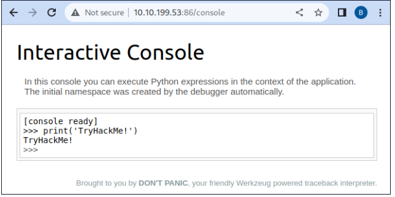

# Security Misconfiguration 

## Introduction 
Security Misconfigurations occur when security settings are not properly configured, even with the latest software installed. This can leave systems vulnerable. 

## Key Points 
• Misconfigurations can include poorly set permissions on cloud services, enabled unnecessary features, unchanged default passwords, overly detailed error messages, and a lack of HTTP security headers. 

• These vulnerabilities can lead to further issues, such as accessing sensitive data and command injection on admin pages. 

• A notable example is the exposure of debugging interfaces in production software, which attackers may exploit if developers forget to disable them before deployment. 

• An incident with Patreon in 2015 highlights this, as an open debug interface was reported prior to a successful hack that allowed command execution. 

## Practical Example 
The virtual machine at http://10. 10. 62. 219:86 demonstrates a Security Misconfiguration. Users are encouraged to try to exploit this misconfiguration to read the application's source code. 

Now accessing the website MACHINE_IP/console
and executing: 
import os; print(os.popen("cat app.py").read())

Allow us to read the content of app.py where we can find the secret_flag = "THM{Just_a_tiny_misconfiguration}"
