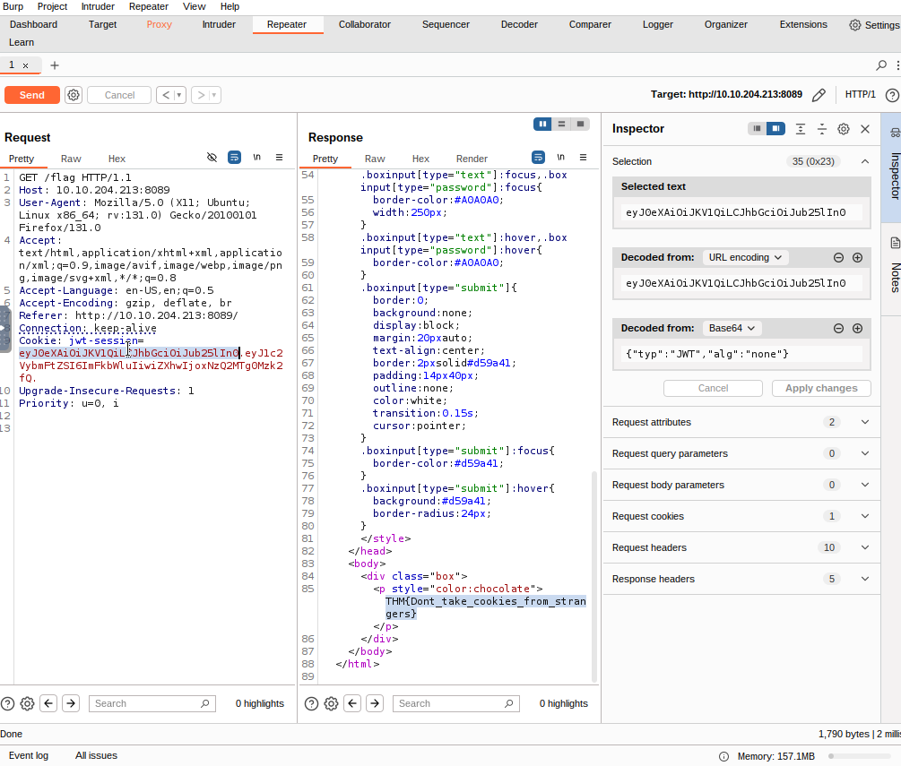

# What is Integrity? 

Integrity refers to the ability to ensure that data remains unchanged. It is crucial in cybersecurity because we want to keep important data safe from unwanted changes. For example, when you download an application, you need to know that it has not been altered during the download process. 

To verify this, a hash is often provided with the file. A hash is a number generated using an algorithm applied to the data, which helps confirm that the file is intact. Common hashing algorithms include MD5, SHA1, and SHA256. 

For instance, when downloading WinSCP, you can find the hashes published alongside the files on their Sourceforge repository. After downloading the WinSCP-5. 21. 5-Setup. exe file, you can check its integrity by recalculating the hashes using specific commands, such as `md5sum`, `sha1sum`, and `sha256sum`. If the recalculated hashes match those published online, you can confirm that the file is unchanged. 

## Software and Data Integrity Failures 

This vulnerability happens when software or data is used without integrity checks, allowing an attacker to modify them, which can lead to unexpected issues. There are two main types of vulnerabilities here: 

• Software Integrity Failures 

• Data Integrity Failures

# Software Integrity Failures 

## Introduction: 
This content explains the risks associated with using third-party libraries in websites, focusing on how these libraries can be manipulated by attackers if not properly secured. 

## Key Points: 
1. Websites often utilize third-party libraries, such as jQuery, directly from external servers. 
2. If an attacker compromises a library's official repository, they can inject malicious code, affecting users who visit the website. 
3. This scenario illustrates a software integrity failure, as no checks are made on the third-party library. 
4. Modern browsers support a security feature called Subresource Integrity (SRI), which allows the inclusion of a hash with the library URL. The library will only run if the downloaded file matches the hash. 
5. The correct way to include a library with SRI is by adding an integrity hash in the HTML code. 

## Conclusion: 
To ensure website security, always use SRI by including the integrity attribute in your script tags. You can generate necessary hashes at https://www.srihash.org/.

# Try Hack Me Question

- Q: What is the SHA-256 hash of https://code.jquery.com/jquery-1.12.4.min.js?
- A: sha256-ZosEbRLbNQzLpnKIkEdrPv7lOy9C27hHQ+Xp8a4MxAQ=

# Data Integrity Failures 

## Introduction 
This content explains how web applications manage user sessions through session tokens, particularly highlighting the risks of data integrity failures. It discusses cookies used for storing session tokens and introduces JSON Web Tokens (JWT) as a solution for ensuring integrity. 

## Key Points 

### Session Management 
• When a user logs into a web application, they receive a session token that must be saved in the browser for session duration.

• This token is included in every request to identify the user, typically stored in cookies. 

### Cookies 
• Cookies are key-value pairs stored in the browser. For instance, a webmail application might send a cookie with the user's username. 

• If a user alters this cookie, they could impersonate another user, leading to a data integrity failure as the application trusts potentially tampered data. 

### Data Integrity Solutions 
• To prevent tampering of cookies, integrity mechanisms are needed. 

• JSON Web Tokens (JWT) provide a solution by ensuring that the key-value pairs in cookies cannot be changed without detection. 

#### JSON Web Tokens (JWT) 
• JWTs consist of three parts: header, payload, and signature. 

• The header indicates it is a JWT and specifies the signing algorithm (HS256). 

• The payload contains the data (key-value pairs). 

• The signature ensures the integrity of the payload, created using a secret key known only to the server. 

• If someone attempts to modify the payload, the signature check will fail, alerting the application to the tampering. 

### Security Challenge with JWT 
• Some JWT libraries had vulnerabilities that allowed attackers to bypass signature validation. 

• Attackers could: 

• Change the header's algorithm (alg) to "none". 

• Remove the signature part.

• For example, altering a JWT to change the username to "admin" without triggering signature checks was possible by modifying the header and payload and re-encoding them. 

### Instructions 
• It is recommended to navigate to a specific URL (http://MACHINE_IP:8089/) to follow detailed instructions related to data integrity failure exploitation. 

### Conclusion 
Understanding data integrity failures is crucial for web application security. Using methods like JWT can help secure session management by preventing unauthorized alterations to user session data. However, awareness of potential vulnerabilities in security libraries is also essential for robust protection against data integrity issues.

# Data Integrity Failures 

## Introduction 
This content explains how web applications manage user sessions through session tokens, particularly highlighting the risks of data integrity failures. It discusses cookies used for storing session tokens and introduces JSON Web Tokens (JWT) as a solution for ensuring integrity. 

## Key Points 

### Session Management 
• When a user logs into a web application, they receive a session token that must be saved in the browser for session duration. 

• This token is included in every request to identify the user, typically stored in cookies. 

### Cookies 
• Cookies are key-value pairs stored in the browser. For instance, a webmail application might send a cookie with the user's username. 

• If a user alters this cookie, they could impersonate another user, leading to a data integrity failure as the application trusts potentially tampered data. 

### Data Integrity Solutions 
• To prevent tampering of cookies, integrity mechanisms are needed. 

• JSON Web Tokens (JWT) provide a solution by ensuring that the key-value pairs in cookies cannot be changed without detection. 

### JSON Web Tokens (JWT) 
• JWTs consist of three parts: header, payload, and signature. 

• The header indicates it is a JWT and specifies the signing algorithm (HS256). 

• The payload contains the data (key-value pairs). 

• The signature ensures the integrity of the payload, created using a secret key known only to the server. 

• If someone attempts to modify the payload, the signature check will fail, alerting the application to the tampering. 

### Security Challenge with JWT 
• Some JWT libraries had vulnerabilities that allowed attackers to bypass signature validation.

• Attackers could: 

• Change the header's algorithm (alg) to "none". 

• Remove the signature part. 

• For example, altering a JWT to change the username to "admin" without triggering signature checks was possible by modifying the header and payload and re-encoding them. 

## Conclusion 
Understanding data integrity failures is crucial for web application security. Using methods like JWT can help secure session management by preventing unauthorized alterations to user session data. However, awareness of potential vulnerabilities in security libraries is also essential for robust protection against data integrity issues.

# Try Hack Me Challenge

This one is a little bit more tricky. So for the first part is fairly easy. All you have to do is try an account and it will suggest you to use Guest:Guest.

Now The Name of the website is jwt-session.

Using burp suite we can also intercept the /flag and send it to repeater, where we can change the jwt token. Instead of guest we put admin, and in alg we put "none". removing the %area" at the end and removing the certificate leaving only the dot, allow us to have access to the admin area, giving us the flag: THM{Dont_take_cookies_from_strangers}.

