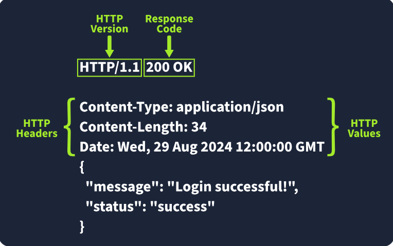

# Response Headers 

When a web server answers an HTTP request, it sends back HTTP response headers, which are key-value pairs. These headers provide important information about the response and instruct the client, typically a browser, on how to manage it. 

## Key Points: 

• Required Response Headers: 

• Date: Indicates when the response was created by the server. Example: `Date: Fri, 23 Aug 2024 10:43:21 GMT`. 

• Content-Type: Shows the type of content being sent, such as HTML or JSON, along with the character set. Example: `Content-Type: text/html; charset=utf-8`. 

• Server: Reveals the server software in use, useful for debugging, but potentially dangerous if exposed. Example: `Server: nginx`. 

• Other Common Response Headers: 

• Set-Cookie: Sends cookies from the server to the client for session management. Example: `Set-Cookie: sessionId=38af1337es7a8`. Use flags like HttpOnly and Secure for security. 

• Cache-Control: Informs the client about caching duration. Example: `Cache-Control: max-age=600`. 

• Location: Used in redirects to specify where to navigate next. Example: `Location: /index. html`. Ensure this is validated to prevent vulnerabilities. 

• Response Body: The actual content sent back by the server, which may include HTML, JSON, images, etc. It's crucial to sanitize any user-generated content to avoid injection attacks like Cross-Site Scripting (XSS).

# Try Hack Me Questions

- Q: Which HTTP response header can reveal information about the web server's software and version, potentially exposing it to security risks if not removed?
- A: Server

- Q: Which flag should be added to cookies in the Set-Cookie HTTP response header to ensure they are only transmitted over HTTPS, protecting them from being exposed during unencrypted transmissions?
- A: Secure

- Q:Which flag should be added to cookies in the Set-Cookie HTTP response header to prevent them from being accessed via JavaScript, thereby enhancing security against XSS attacks?
- A: HttpOnly