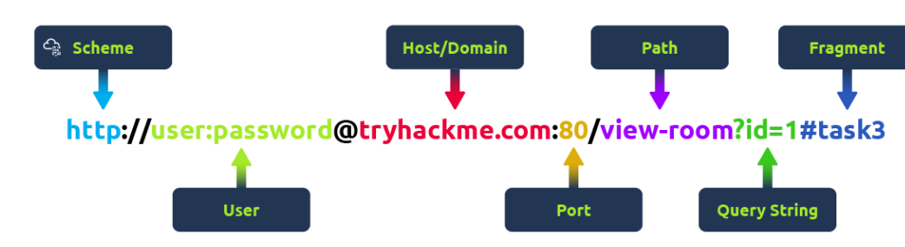

# Uniform Resource Locator (URL) 

A Uniform Resource Locator (URL) is a web address that allows access to various online content such as webpages, videos, and photos. It directs your browser to specific locations on the Internet. 

## Anatomy of a URL 

A URL consists of multiple parts, each serving a different function in helping users find resources online. Knowing how these parts work together is crucial for web browsing, application development, and troubleshooting. 

## Key Components: 

• __Scheme__: The protocol to access the website, common ones being HTTP (HyperText Transfer Protocol) and HTTPS (HyperText Transfer Protocol Secure). HTTPS is recommended for its security due to encryption. 

• __User__: Some URLs may include a user’s login details, though this is rare as it poses security risks by exposing sensitive information. 

• __Host/Domain__: The most vital part of the URL that indicates which website is being accessed. Domain names must be unique and are registered. Beware of similar-looking domain names used in phishing attacks. 

• __Port__: This number directs the browser to the correct service on the web server, commonly 80 for HTTP and 443 for HTTPS. 

• __Path__: Points to the specific file or page on the server. It is essential to secure these paths to restrict access to authorized users. 

• __Query String__: Begins with a question mark (? ) and often includes search terms or inputs. It requires secure handling to prevent injection attacks. 

• __Fragment__: Starts with a hash symbol () and directs to a specific section of a webpage. Like query strings, it should be checked to avoid injection issues. 

## Conclusion

In conclusion, understanding a URL’s components is vital for safely navigating the web and ensuring secure access to content.

# Try Hack Me Questions

- Q: Which protocol provides encrypted communication to ensure secure data transmission between a web browser and a web server?

- A: https (Hyper Text Protocol Secure)

- Q: What term describes the practice of registering domain names that are misspelt variations of popular websites to exploit user errors and potentially engage in fraudulent activities?

- A: Typosquatting

- Q: What part of a URL is used to pass additional information, such as search terms or form inputs, to the web server?

- A: Query String