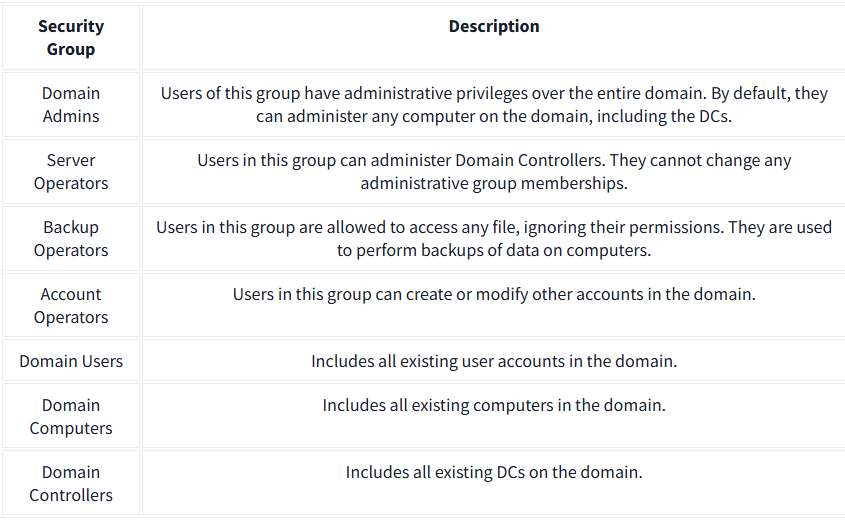

# Active Directory Domain Services 

Active Directory Domain Services (AD DS) is essential for managing various objects in a Windows network. This includes users, groups, machines, and more. 

## Key Points 

1. Users: 

• Users are a main type of object in AD and are known as security principals, which means they can be authenticated and granted access to network resources. 

• Users can represent: 

• People: Employees who need network access. 

• Services: Accounts used by services like IIS or MSSQL, separate from regular users as they only have necessary privileges. 

2. Machines: 

• Every computer that joins the AD domain has a machine object created for it. 

• Machine objects are also security principals with an account that has limited rights. 

• Machine accounts are local administrators on their computer and should not be accessed by anyone except the machine itself. Passwords for machine accounts are rotated and consist of 120 random characters. 

• They follow a naming convention: the computer’s name followed by a dollar sign (e. g. , DC01$). 

3. Security Groups: 

• Security groups simplify resource access management by allowing permissions to be assigned to groups rather than individual users. 

• Both users and machines can be group members, and groups can contain other groups. 

• Default groups in a domain include: 

• Domain Admins: Full administrative rights. 

• Server Operators: Administer Domain Controllers. 

• Backup Operators: Can access all files to perform backups. 

• Account Operators: Can manage user accounts. 

• Domain Users: All user accounts in the domain. 

• Domain Computers: All computers in the domain. 

• Domain Controllers: All Domain Controllers. 

4. Active Directory Users and Computers: 

• To manage objects in Active Directory, log into the Domain Controller and open "Active Directory Users and Computers" from the start menu. 

• This interface displays users, computers, and groups organized in Organizational Units (OUs) which categorize users and machines. 

• OUs are typically structured around a business's departments and allow specific policies to be applied based on organizational roles. 

5. Default Containers: 

• Apart from OUs, default containers created by Windows include: 

• Builtin: Default groups for any Windows host. 

• Computers: Default container for newly joined machines. 

• Domain Controllers: Holds all DCs. 

• Users: Default domain-wide groups and users. 

• Managed Service Accounts: Accounts for services in the domain. 

6. Security Groups vs. OUs: 

• OUs are for applying specific policies and configurations related to users and computers. A user can belong to only one OU at a time.

• Security Groups are for granting permissions to resources, allowing users to be part of multiple groups for different accesses. 

## Conclusion 

Active Directory Domain Services is crucial for managing network objects. Understanding the roles of users, machines, security groups, and organizational units helps maintain an efficient and secure network environment. You can create and manage users, groups, and OUs to align with your organization’s structure and access needs.