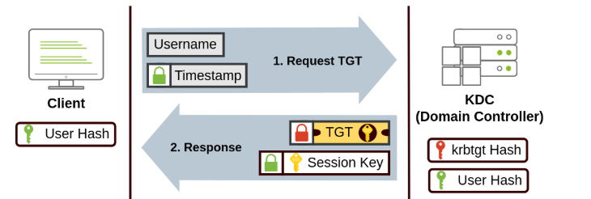
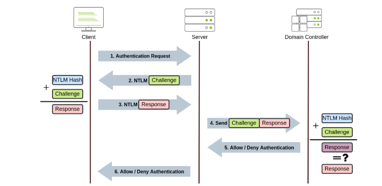

# Network Authentication Protocols in Windows Domains 

## Introduction: 
In Windows domains, users' credentials are stored in Domain Controllers. When users authenticate to services, these controllers verify their credentials. There are two main protocols for authentication in these domains: Kerberos and NetNTLM, the latter being legacy and mainly used for compatibility. 

## Key Points: 

1. Kerberos Authentication: 

• Kerberos is the standard protocol for recent Windows versions. 

• Users are assigned tickets when they log into a service, serving as proof of authentication. 

__Process__: 

• The user sends their username and a timestamp (encrypted with a key from their password) to the Key Distribution Center (KDC), which is typically found on the Domain Controller. 

• The KDC issues a Ticket Granting Ticket (TGT) allowing users to request more service tickets without re-entering credentials. 

• This TGT includes a Session Key, which the user needs for subsequent requests. 

Step 1: Requesting a Ticket Granting Service (TGS): 

• To access a specific service, the user requests a TGS by sending their username, timestamp (encrypted with the Session Key), TGT, and the Service Principal Name (SPN) to the KDC. 

• The KDC responds with the TGS and a Service Session Key for authenticating the service. 

Step 2: Authenticating to the Service: 

• The user sends the TGS to the service to establish a connection. 

• The service validates the TGS using its account’s password hash to check the Service Session Key. 

2. NetNTLM Authentication: 

• NetNTLM operates through a challenge-response method. 

__Process__: 
• The client requests authentication from the server. 

• The server generates a random number (challenge) and sends it to the client. 

• The client creates a response combining their NTLM password hash with the challenge and sends it back. 

• The server forwards both the challenge and the response to the Domain Controller. 

• The Domain Controller recalculates the expected response and compares it with the client's response. If they match, authentication is successful; if not, access is denied. 

• The authentication result is sent back to the server and then forwarded to the client. 

__Note__: 

• The user's password or hash is never transmitted over the network for security reasons.

• If a local account is used instead of a domain account, the server can verify the response without querying the Domain Controller, as it has the password hash stored locally. 

## Conclusion: 
Kerberos and NetNTLM are essential protocols for user authentication in Windows domains, each with distinct processes ensuring secure access to network services. Understanding these protocols helps maintain the security and integrity of domain environments.