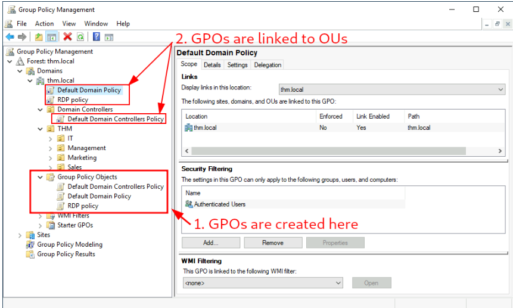

# Managing Group Policy Objects (GPO) in Windows 

## Introduction: 
Windows uses Group Policy Objects (GPO) to manage settings for organizational units (OUs). GPOs can have policies for users or computers, helping establish a baseline for machines and identities. This guide explains how to configure GPOs and implement specific policies. 

## Key Points: 

1. What are GPOs? 
GPOs are collections of settings that can be applied to OUs. They allow administrators to set policies for users and computers in an organization. 

2. Using the Group Policy Management Tool: 
Access the Group Policy Management tool from the start menu. This tool displays the complete OU hierarchy. To configure policies, create a GPO and link it to an OU. 

3. Existing GPOs: 
Existing GPOs on a machine may include the Default Domain Policy and others that are linked to specific OUs or the entire domain. Any GPO linked to an OU applies to that OU and its sub-OUs. 

4. Examining the Default Domain Policy: 
The scope tab shows where the GPO is linked in Active Directory (AD). GPOs can also have Security Filtering, allowing policies to apply to specific users or computers. The Settings tab displays what configurations the GPO applies. 

5. Editing GPO Settings: 
To edit a GPO, right-click it and select Edit. For example, to change the minimum password length, navigate to the appropriate settings within the GPO. 

6. GPO Distribution: 
GPOs are distributed via a network share called SYSVOL, located on the Domain Controller (DC). Changes to GPOs may take up to 2 hours to propagate. To force immediate updates, use the command `gpupdate /force`. 

7. Creating GPOs for THM Inc. : 
The task involves implementing GPOs to secure the environment: 

• Restrict Access to Control Panel: 
Create a GPO to limit Control Panel access to IT department users. Link the GPO to relevant OUs (e. g. , Marketing, Management, Sales). 

• Auto Lock Screen GPO: 
This GPO will lock computers after 5 minutes of inactivity. It can be linked to the root domain to affect all child OUs or specifically to Workstations, Servers, and Domain Controllers OUs. 

8. Notes on GPO Application: 
If a GPO is applied to the root domain, it will affect all computers, but non-computer OUs will ignore computer configurations. Testing the GPOs can be done by logging in with appropriate credentials. 

## Conclusion: 
Creating and managing GPOs is essential for maintaining security and efficiency in a networked environment. Properly configured GPOs can help restrict user access to sensitive areas like the Control Panel and ensure that workstations lock automatically after a specified period of inactivity. If GPOs do not take effect, remember to use the `gpupdate /force` command to refresh the policies.