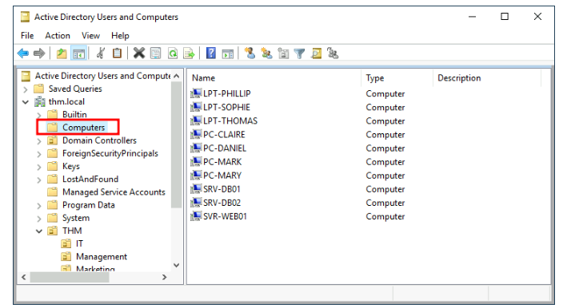

# Organizing Devices in Active Directory 

## Note
This Note file is related to the Try Hack Me Challenge where we need to organize all computers trough two OUs. 

## Introduction: 
When machines join a domain, they typically go into a container called "Computers," except for Domain Controllers (DCs). It's important to organize these devices for better management and policy application. 

## Key Points: 

1. Current Setup: 
In the "Computers" Organizational Unit (OU), various devices like servers, laptops, and PCs are already present. 

2. Need for Organization: 
It's not ideal to have all devices grouped together since different devices require different policies. 

3. Suggested Categories: 
• Workstations: Common devices used by users for work and browsing, where privileged users should not log in. 
• Servers: Used to provide services to users or other servers. 
• Domain Controllers: Sensitive devices that manage the Active Directory Domain and hold hashed passwords for all user accounts. 

## Conclusion: 
To improve the Active Directory structure, create separate OUs for Workstations and Servers directly under the thm. local domain container, while Domain Controllers will remain in their designated OU.