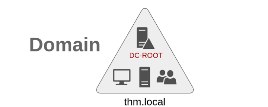
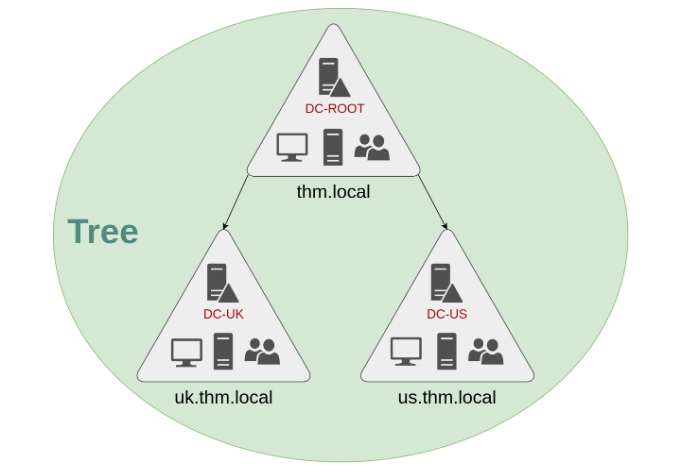
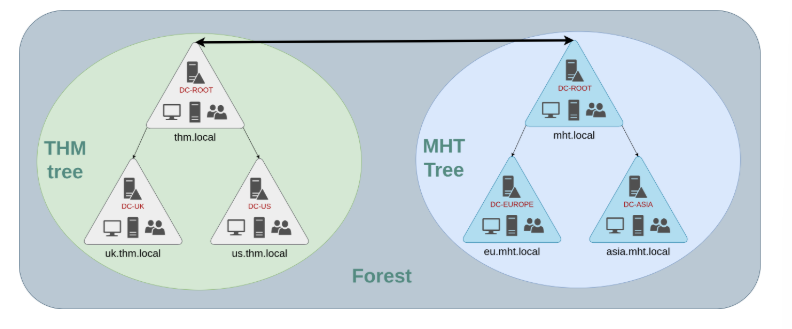
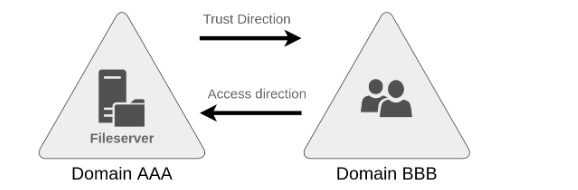

# The Role of a Domain Controller in Managing Networks 

## Introduction 
As companies grow, their networks expand, and the complexity of managing computers, servers, and users increases. This guide discusses the operations of a Domain Controller, the structure of domains, and how they connect within trees and forests. 

## Key Points 

1. Single Domain 
Organizations usually start with a single domain. However, as they expand, especially internationally, they may require multiple domains to meet various legal and organizational needs. 

2. Trees 
When a company expands to another country with different regulations, it can set up a tree structure in Active Directory (AD). This allows for multiple subdomains under a root domain, such as “thm. local” being divided into “uk. thm. local” and “us. thm. local. ” Each subdomain has its own Domain Controller (DC) and can manage its unique resources independently, ensuring that users can only access what pertains to their domain. 

3. Enterprise Admins and Domain Admins 
The structure introduces a new roleEnterprise Adminswho have administrative rights over all domains within the enterprise. Each domain will still have its Domain Admins with privileges limited to their specific domain. 

4. Forests 
If a company merges with another, like MHT Inc. , it may develop different trees for each company, creating a forest. This structure allows separate IT departments to manage their domains efficiently. 

5. Trust Relationships 
With multiple domains organized in trees and forests, trust relationships can be formed. A trust relationship allows users from one domain to access resources in another. For example, a user from “THM UK” can access files from “MHT EU. ” 

• One-Way Trust: A one-way trust allows users from one domain to access resources in another without reciprocal access.

• Two-Way Trust: This enables mutual authorization, allowing users from both domains to access each other's resources. 
 

## Conclusion 
Managing domains through trees and forests, along with establishing trust relationships, allows organizations to efficiently control access and resources across various locations and departments while maintaining security and compliance.