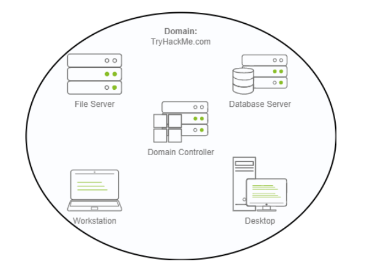

# Managing a Small Business Network 

## Introduction 
Managing a small business network can be simple when the setup is small, but it becomes complicated as the business grows. 

## Key Points 
• In a small network with five computers and employees, each computer can be configured individually. You would manually create user accounts and fix issues on-site. 

• If the business expands to 157 computers and 320 users across multiple offices, managing each computer separately becomes unmanageable. 

• To handle such complexity, using a Windows domain is beneficial. A Windows domain consists of users and computers managed together. 

• The key component is Active Directory (AD), which centralizes administration for the network. The server running AD is called the Domain Controller (DC). 

• __Advantages of a Windows domain include__: 

• Centralized Identity Management: Easily configure all user accounts from AD. 

• Managing Security Policies: Apply security policies network-wide from AD. 

• Real-world example: In schools or universities, users log in to any computer with a single set of credentials, verified by AD. 

• Restrictions, such as access to control panels, are enforced through policies managed in the domain. 

## Conclusion 
As the new IT admin at THM Inc. , you need to review the current domain "THM. local" and make additional configurations using administrative credentials on the Domain Controller. Click the Start Machine button to access the task machine.