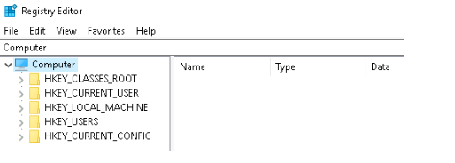

# Overview of Windows Registry 

## Introduction: 
This content discusses the Windows Registry and its significance. 

## Key Points: 
• The Windows Registry is a central database that configures system settings for users, applications, and hardware. 

• It includes user profiles, installed applications, folder settings, hardware information, and used ports. 

• Editing the registry is recommended only for advanced users, as it can affect computer functions. 

• The Registry Editor (regedit) is one available tool to view or edit the registry. 

• regedt32.exe or regedit.