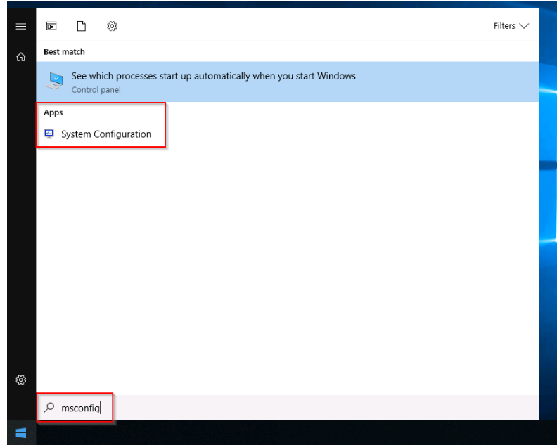
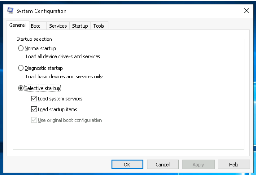
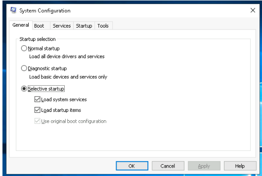
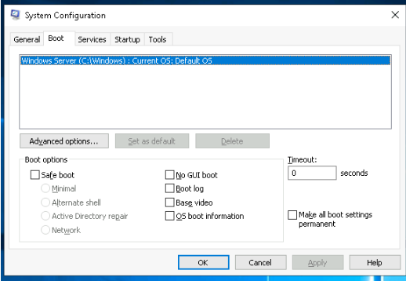
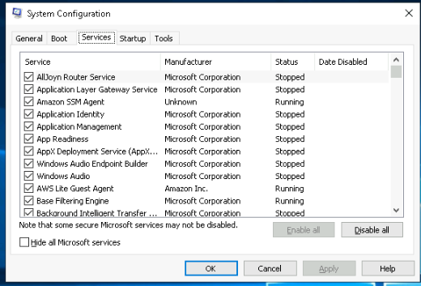
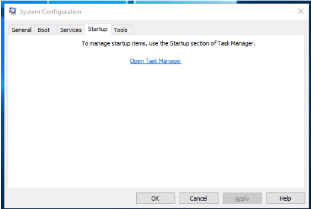
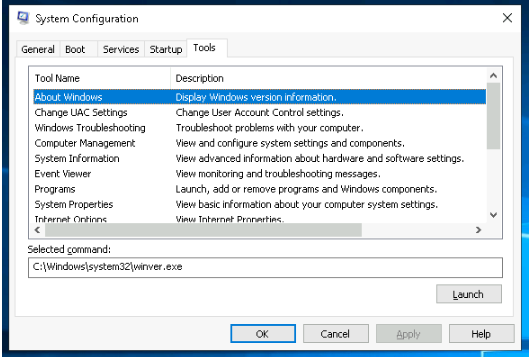

# System Configuration Utility (MSConfig) 

## Introduction 
The System Configuration utility (MSConfig) is a tool for advanced troubleshooting, primarily used to diagnose startup issues. 

## Key Points 
• To access MSConfig, local administrator rights are required, and it can be launched from the Start Menu. 

• MSConfig features five tabs: General, Boot, Services, Startup, and Tools. 

• General Tab: Choose how Windows loads devices and services: Normal, Diagnostic, or Selective. 

• Boot Tab: Set boot options for the Operating System. 

• Services Tab: Displays all services on the system, whether they are running or stopped. 

• Startup Tab: Does not show content in the attached VM; Microsoft recommends using Task Manager for managing startup items instead. 

• Tools Tab: Lists various utilities for further operating system configuration, with descriptions provided for each tool. 

• Tools can be launched using the command prompt, run prompt, or by clicking the Launch button. 

## Conclusion 
MSConfig is a powerful utility for diagnosing startup issues, but users should utilize Task Manager for managing startup items.