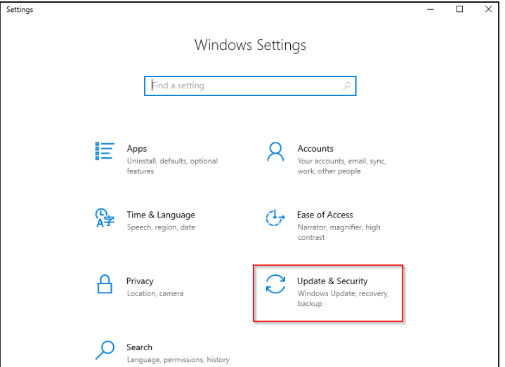
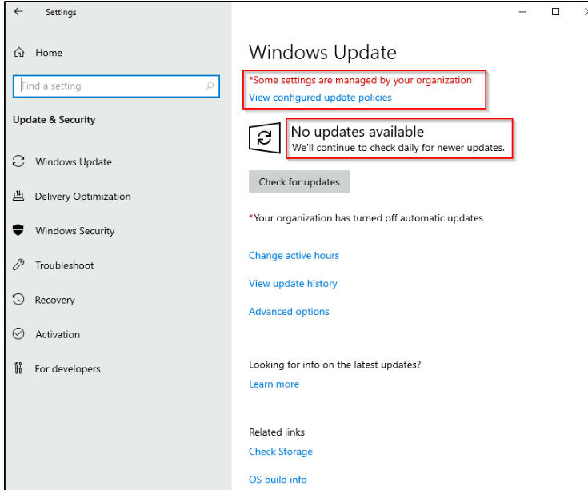

# Windows Update 

## Introduction 
Windows Update is a service from Microsoft that provides important updates for the Windows operating system and other Microsoft products, such as Microsoft Defender. 

## Key Points 
• Updates are generally released on the 2nd Tuesday of each month, known as Patch Tuesday. However, urgent updates may be released at other times. 

• Users can access Windows Update through the Settings menu or by using the command control /name Microsoft. WindowsUpdate in the Run dialog box or CMD. 

• Many users have delayed updates in the past, often because a reboot is required. Microsoft has changed this with Windows 10, as updates can now only be postponed but must eventually be installed, requiring a reboot. 

