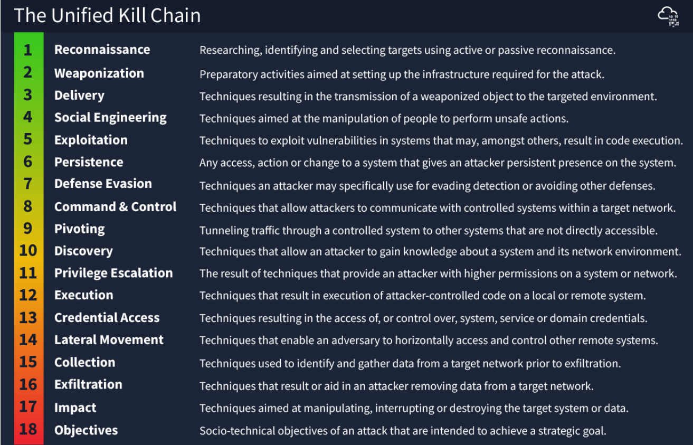

#  Unified Kill Chain (UKC) 

## Introduction 
Paul Pols' Unified Kill Chain (UKC), published in 2017, aims to enhance existing cybersecurity frameworks rather than replace them. 

## Key Points 
• The UKC consists of 18 phases of an attack, including reconnaissance, exploitation, data exfiltration, and understanding motives. 

• These phases are summarized into key focus areas for clarity. 

• The UKC is modern and detailed, as it was updated in 2022, unlike some other frameworks like MITRE's created in 2013. 

• It covers the entire attack process, addressing stages like post-exploitation and the attacker’s motivation. 

• The UKC reflects more realistic attack scenarios, acknowledging that attackers often switch phases during an assault, which other frameworks do not typically consider. 

## Conclusion 
The UKC offers a comprehensive and practical approach to understanding cyber attacks, standing out due to its depth and modernity.