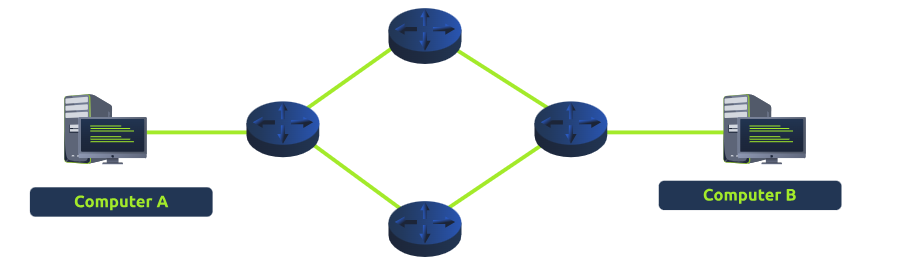
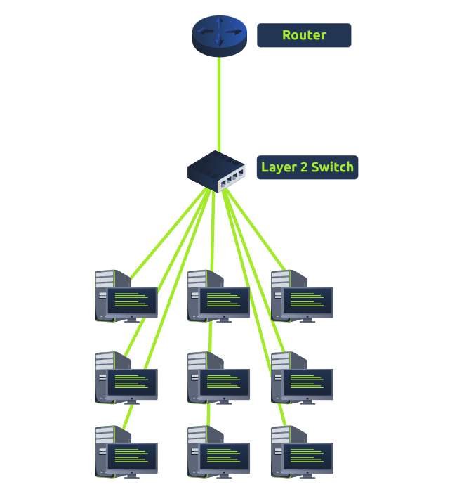
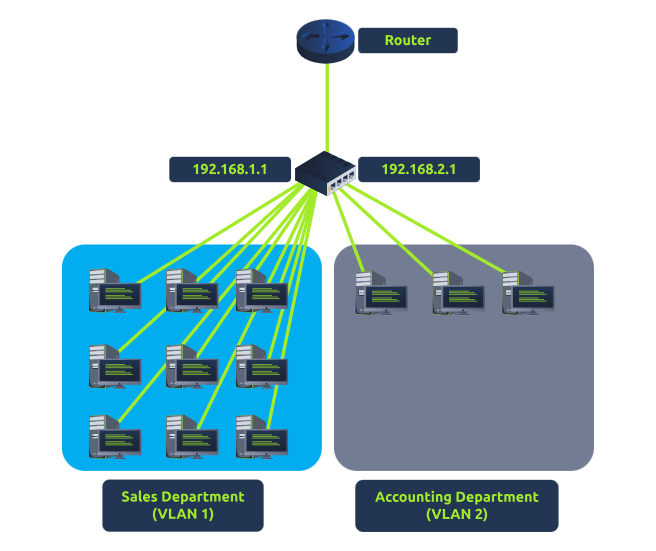

# Lan Networking Devices

## What is a Router? 

A router connects different networks and helps data travel between them through a process called routing. It works at Layer 3 of the OSI model and often has an interface for settings like port forwarding and firewall rules. It chooses the best path for data, which can depend on factors such as the path's length, reliability, and speed of the medium. 

## What is a Switch? 

A switch connects multiple devices (3 to 63) using Ethernet cables. It operates mainly at Layer 2 and Layer 3 of the OSI model but cannot function as both at the same time. Layer 2 switches forward frames to devices using their MAC addresses, while Layer 3 switches can also route packets using IP addresses. 

## VLAN

VLAN (Virtual Local Area Network) technology allows devices to be separated within a network for security, enabling them to access the Internet without communicating with each other. For example, the Sales and Accounting departments can connect to the Internet but not interact with one another while using the same switch.

