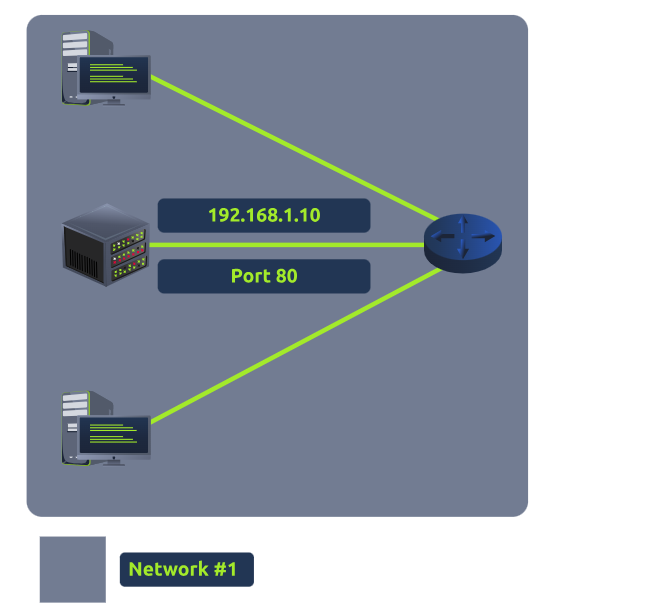
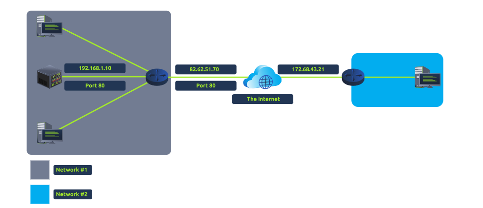

# Understanding Port Forwarding 

## Introduction: 
Port forwarding is crucial for making applications and services available on the Internet. Without it, these services can only be accessed by devices on the same local network. 

    

## Key Points: 
• In a local network example, a server with the IP "192. 168. 1. 10" can only be accessed by two other computers, limiting its reach to an intranet. 
• To allow public access to the website, the administrator must set up port forwarding, allowing external devices to connect using the network's public IP "82. 62. 51. 70. " 
• Port forwarding should not be confused with firewalls; port forwarding opens specific ports, while firewalls control traffic flow across these ports. 
• Port forwarding is configured at the network router. 
• If the admin wanted to build an website, they would have to implement port forwarding like the diagram below (from tryhackme):

## Conclusion: 
Port forwarding enables external access to internal services by configuring settings at the router, enhancing connectivity for web servers and other applications.