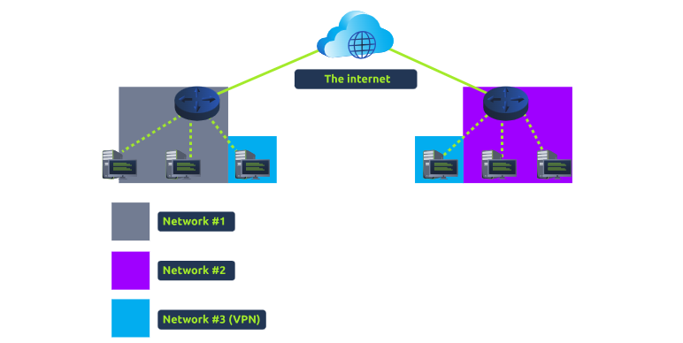
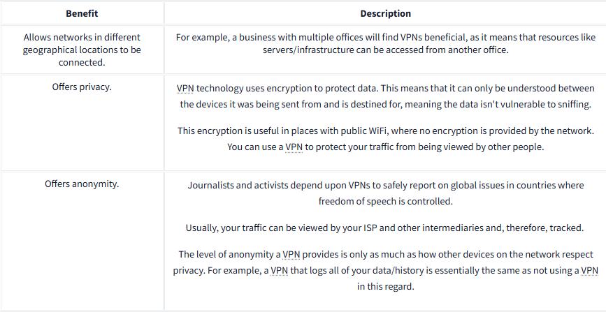
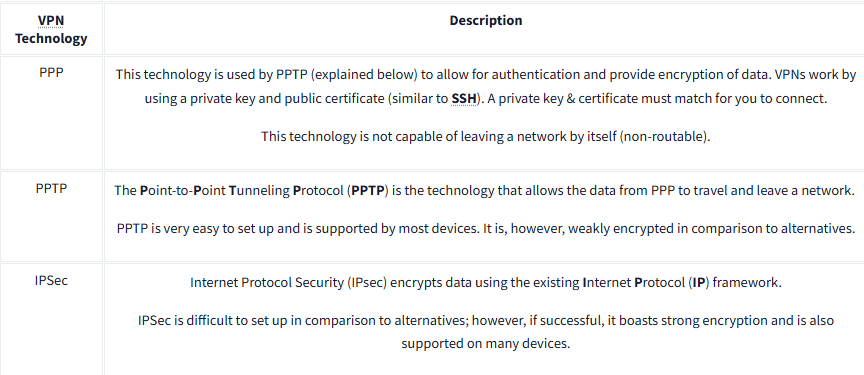

# Virtual Private Networks (VPNs) 

## Introduction: 
A Virtual Private Network (VPN) is a technology that enables secure communication between devices on different networks by creating a private tunnel over the Internet. 

## Key Points: 

• Functionality: VPNs connect devices from separate networks, allowing them to communicate securely. For example, devices connected through a VPN form a private network (Network 3) that allows communication between two offices (Network 1 and Network 2). 

• __Benefits__: 
• Connection Across Locations: VPNs help businesses with multiple offices connect their resources remotely. 
• Privacy: VPNs use encryption to protect data, making it unreadable to others when transmitted over the Internet, particularly beneficial on public WiFi. 
• Anonymity: VPNs allow users, like journalists and activists, to report safely in areas with restricted freedom of speech, although some VPNs may log data, reducing anonymity. 

• Use in TryHackMe: TryHackMe uses VPNs to allow secure interaction with vulnerable machines without direct Internet access, protecting users and the service. 

• __Technologies__: 
• PPP: Provides authentication and data encryption but cannot leave a network alone. 
• PPTP: Allows data from PPP to leave a network but offers weak encryption. 
• IPSec: Provides strong encryption on the Internet Protocol but is more complex to set up. 

## Conclusion: 
VPNs are crucial for secure communication, offering privacy and connectivity across different locations, enhanced through various technologies.