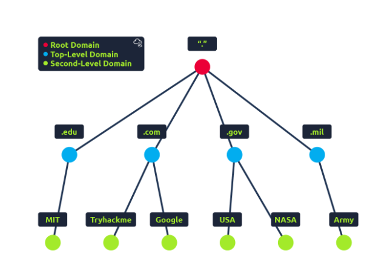

# Domain Hierarchy Summary 

## Introduction 
The domain hierarchy explains the structure of domain names, illustrating how they are organized from broader categories to specific names. 

## Key Points 
• TLD (Top-Level Domain): This is the last part of a domain name, like .com in tryhackme.com. There are two types: gTLD (Generic) and ccTLD (Country Code). gTLDs indicate the purpose (e. g. , .com for commercial), while ccTLDs indicate location (e. g. , . ca for Canada). New gTLDs are constantly being created. 

• Second-Level Domain: In tryhackme.com, "tryhackme" is the Second-Level Domain, which is limited to 63 characters and accepts a-z, 0-9, and hyphens. 

• Subdomain: A subdomain, such as admin in admin. tryhackme.com, appears before the Second-Level Domain and has similar character restrictions. Subdomains can be multiple and must stay under 253 characters total. 

## Conclusion 
Understanding domain hierarchy is essential for web development and management, as it outlines the structure of domain names from TLDs to individual subdomains.