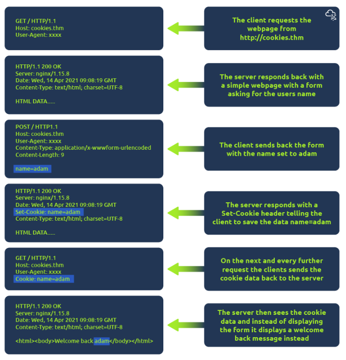

# Understanding Cookies 

Cookies are small pieces of data saved on your computer when you receive a "Set-Cookie" header from a web server. They help remind the web server about your identity, personal settings, or previous visits since HTTP does not remember past requests. 

## Key Points: 
• Cookies are commonly used for website authentication. 

• The cookie value is typically a token, not a visible password. 

• You can view cookies sent by your browser using developer tools. 

• To access developer tools, click on the "View Site" button for guidance. 

• In developer tools, use the "Network" tab to see all resource requests and the "Cookies" tab for cookie details. 

## Conclusion 

Cookies play an important role in online browsing by storing user information and preferences.