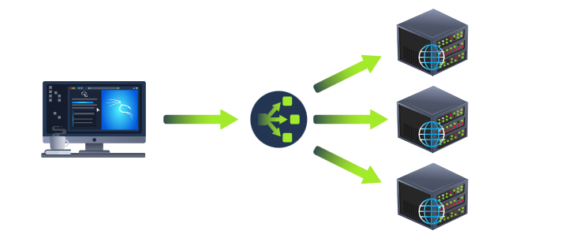
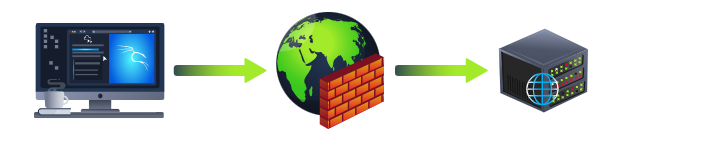

# Load Balancers, CDN, Databases, and WAF 

## Introduction 
This summary provides an overview of load balancers, content delivery networks (CDNs), databases, and web application firewalls (WAFs). 

## Key Points 

• Load Balancers: They help manage high traffic on websites by distributing requests across multiple servers. They can use algorithms like round-robin or weighted to decide which server to send a request to. Load balancers check server health and stop directing traffic to any unresponsive server until it is back online. 

• CDN: A CDN reduces the load on busy websites by storing static files (like images and scripts) on many global servers. It directs user requests to the nearest server, improving speed and efficiency. 

• Databases: Websites often need to store user information, which can be done through databases. These can vary from simple text files to complex server clusters. Common databases include MySQL, MSSQL, MongoDB, and Postgres. 

• WAF: A WAF protects web servers from attacks by analyzing incoming requests. It identifies and blocks potential threats using techniques like rate limiting, which restricts request rates from single IP addresses. 

## Conclusion 
Understanding these components is crucial for maintaining the performance and security of web applications.