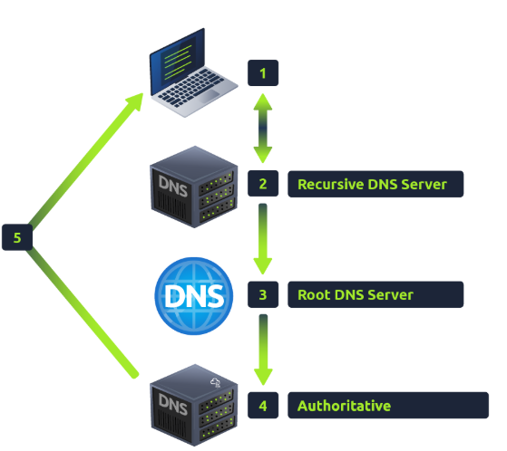

# What Happens When You Make a DNS Request 

- When you request a domain name, your computer first checks its local cache for the address. If it’s not there, it sends a request to the Recursive DNS Server, usually provided by your ISP. This server also has a cache, and if it finds the result, it sends it back to your computer. If not, the search begins at the root DNS servers. 

- Root servers redirect you to the appropriate Top Level Domain (TLD) Server, based on the requested domain, like .com for www. tryhackme.com. The TLD server then directs the request to the authoritative server (nameserver) for that domain, which has the DNS records. The authoritative DNS server stores these records and sends the response back to the Recursive DNS Server, which caches it for future requests. Each record has a TTL (Time To Live) value indicating how long it should be stored before needing another lookup.

