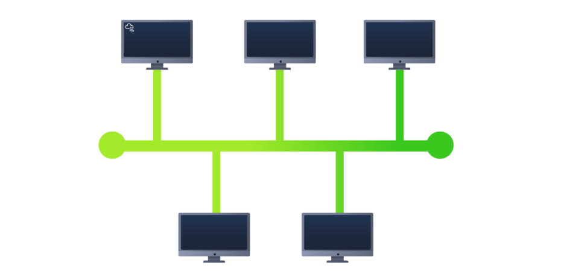
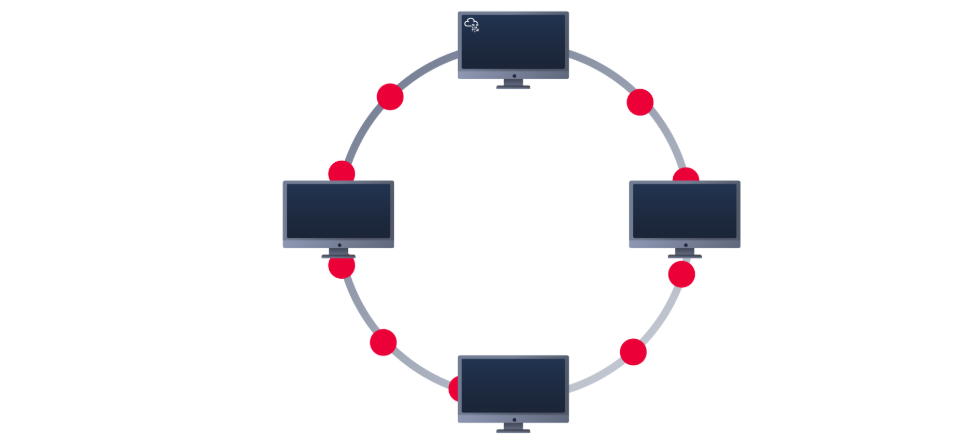
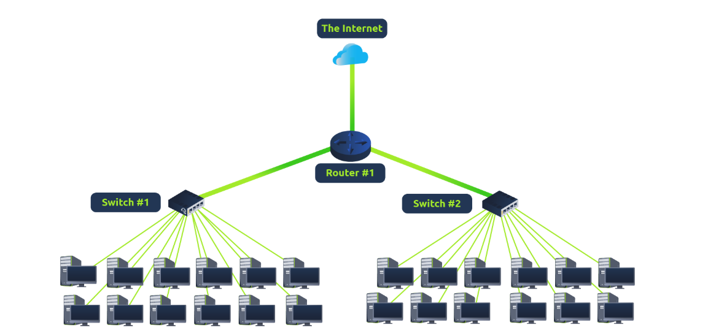
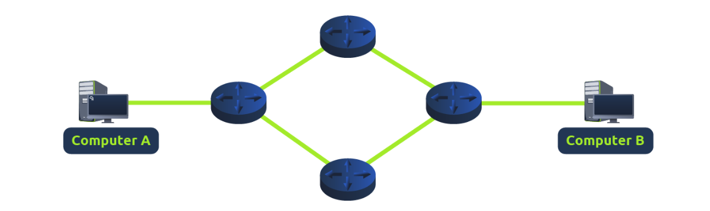

# Local Area Network (LAN) Topologies 

## Introduction 
This content discusses various designs of Local Area Networks (LAN), known as topologies. Each topology has its own advantages and disadvantages that impact network performance and management. 

## Key Points 

1. Star Topology 
• Devices connect to a central device like a switch or hub. 
• Advantages: 
• Reliable and scalable, making it easy to add devices. 
• Disadvantages: 
• More expensive due to increased cabling and equipment. 
• Higher maintenance needed as the network grows. 
• A failure of the central device affects all connected devices. 

2. Bus Topology 
• All devices connect to a single backbone cable. 
• Advantages: 
• Cost-effective and easy to set up. 
• Disadvantages: 
• Data congestion can occur, leading to slow performance. 
• Troubleshooting is difficult due to all data traveling the same route. 
• If the backbone cable fails, all devices lose connectivity. 

3. Ring Topology 
• Devices connect in a loop, sending data around until it reaches the destination. 
• Advantages: 
• Less cabling required; easier troubleshooting since data moves in one direction. 
• Reduced chances of bottlenecks compared to bus topology. 
• Disadvantages: 
• If any device or connection fails, the entire network breaks down. 
• Data may take longer to reach its destination as it may pass through multiple devices first. 

4. What is a Switch? 
• A switch connects multiple devices in a network via ports and is common in larger networks. 
• More efficient than hubs because switches direct data only to the intended device, minimizing unnecessary network traffic. 

5. What is a Router? 
• Routers connect different networks and facilitate the transfer of data between them. 
• They establish paths for data to travel, ensuring successful delivery across diverse network connections. 

## Conclusion 
Understanding LAN topologies, switches, and routers is vital for designing and managing effective networking environments. Each topology offers unique benefits and challenges that can influence the performance and reliability of a network.